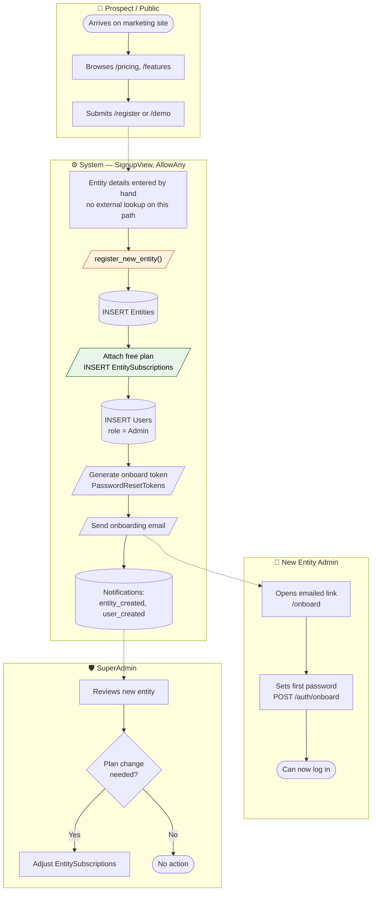
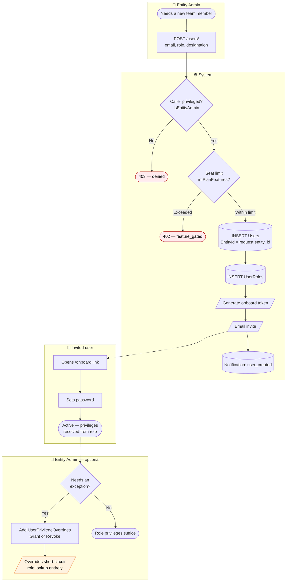
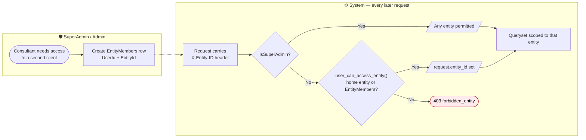

# BPMN 01 — Tenant Onboarding & User Provisioning

From a prospect arriving on the marketing site to a fully provisioned user who can log in.

**Lanes** map to the four seeded roles: `SuperAdmin` (1), `Admin` (2), `Manager` (3),
`Staff` (4), plus the automated **System** lane.

**Related user stories** — [Tenancy & access — SDO-TEN-01, 02, 07](../../stories/01-tenancy-access.md) · [Billing — SDO-BIL-02](../../stories/06-billing-platform.md)

## Process

> **Correction (2026-08-21).** An earlier version of this diagram showed the Companies House
> lookup pre-filling entity details during self-service registration. **That flow does not
> exist.** `SignupView` is `AllowAny` and `register_new_entity()` never calls Companies House;
> `CompaniesHouseLookupView` (`apps/shared/urls_integrations.py:9`) requires `IsAuthenticated`,
> so an anonymous prospect cannot reach it. The lookup is available to an already-authenticated
> user maintaining entity details, not to a prospect signing up. The original was inferred from
> `spec/api_integrations.md` rather than read from the code — the drift that
> [SDO-GAP-10](../../stories/07-backlog-gaps.md#sdo-gap-10) is about.

**Ordering constraint.** `seed_plans` must have run before any entity is created —
`EntityCreateSerializer` looks up the free plan to attach a subscription, and entity creation
fails without it. This is why the seed sequence in the README is ordered
`seed_superadmins → seed_modules → seed_gwp → seed_plans` before any tenant exists.

## Sub-process: inviting additional users

A user's `EntityId` is always taken from `request.entity_id`, never from the request body —
so an Admin cannot provision a user into somebody else's tenant.

## Sub-process: multi-entity access (ESG consultants)

This is the mechanism that lets one consultant serve several client entities without
duplicate user accounts. Without an `X-Entity-ID` header the user falls back to their home
entity (`Users.EntityId`).

---
*Source: `backend/apps/entities/services.py`, `backend/apps/entities/middleware.py`,
`backend/apps/users/views.py`, `backend/apps/users/serializers.py`,
`backend/apps/billing/services.py`, `backend/apps/shared/permissions.py`*
