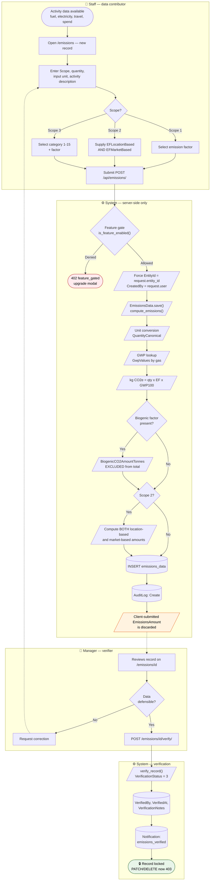
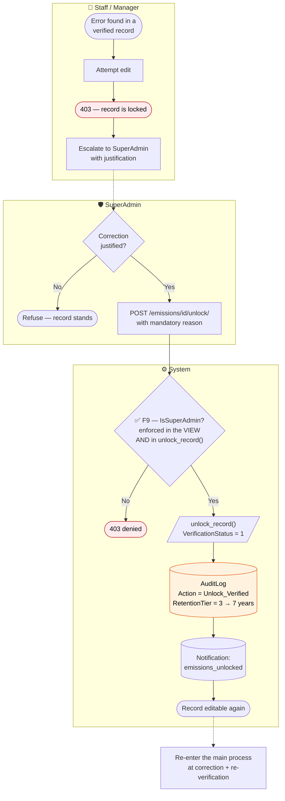
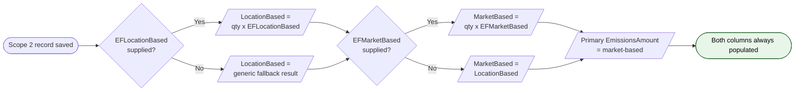

# BPMN 02 — Emissions Data Lifecycle

From activity data capture to a locked, verified record — including the correction path.

## Main process

**The controlling rule:** emissions are never computed on the client. `EmissionsAmount`,
`EmissionsAmountTonnes`, `QuantityCanonical`, `BiogenicCO2AmountTonnes`, and both Scope 2
amounts are populated by `compute_emissions()` inside `EmissionsData.save()`. Whatever the
client sends for those fields is overwritten.

## Correction path — unlocking a verified record

The 7-year audit entry is the compliance artefact: every unlock is permanently attributable
to a named SuperAdmin with a stated reason.

> **✅ F9 · Authorization — guard moved into the service — fixed 2026-08-21.**
> `unlock_record()` (`apps/emissions/services.py:169`) performed the privileged state change
> but checked nothing itself — its own docstring said *"Only callable by SuperAdmin — the view
> enforces that guard."* A management command, admin action or bulk-correction task could have
> unlocked verified records with no authorization check; the audit row would still be written,
> so the action stayed traceable, but it was never authorized.
> **Now:** `unlock_record()` raises `PermissionDenied` when `unlocked_by` is not a SuperAdmin,
> before any mutation or audit write, so a rejected unlock leaves no trace. The view's inline
> check is retained for its specific response body — the guard now lives in both places.
> See [F9 in the findings register](../FINDINGS.md#f9).

## Scope 2 dual-method detail

GHG Protocol Scope 2 Guidance requires both methods to be reported. The platform always
populates both columns, even when only one factor was supplied.

Both branches recompute on **every** save rather than only when the column is null — that
keeps re-saves idempotent instead of preserving a stale value from a previous save.

---
*Source: `backend/apps/emissions/views.py`, `backend/apps/emissions/services.py`,
`backend/apps/emissions/models.py`, `backend/apps/billing/mixins.py`*
