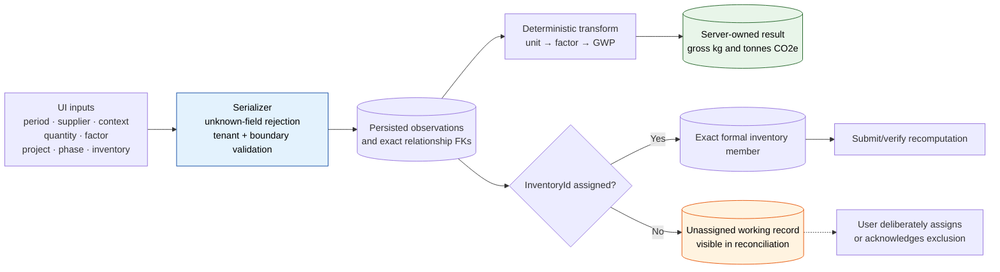
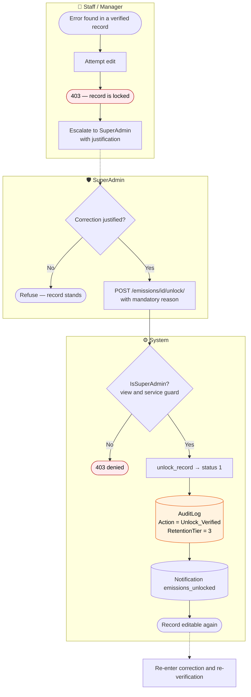
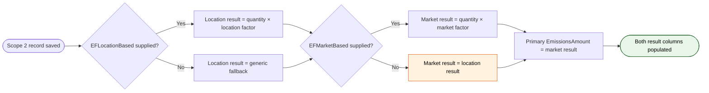

# BPMN 02 — Emissions Data Lifecycle

From source activity capture to a calculated, attributable, and optionally verified record.

**Related user stories** — [GHG accounting — SDO-GHG-01…14](../../stories/02-ghg-accounting.md) · [Inventory & assurance — SDO-INV-03, 06…09](../../stories/03-inventory-assurance.md)

**Linear traceability** — [SUS-21 · source-field preservation](https://linear.app/susdevos/issue/SUS-21/cfi-001-stop-silently-discarding-emission-form-fields) · [SUS-22 · tenant-owned relationships](https://linear.app/susdevos/issue/SUS-22/cfi-006-enforce-tenant-ownership-on-every-critical-relationship) · [SUS-25 · project/phase/inventory assignment](https://linear.app/susdevos/issue/SUS-25/cfi-008-connect-project-phases-and-inventory-assignment-end-to-end) · [SUS-33 · explicit inventory membership](https://linear.app/susdevos/issue/SUS-33/cfi-015-compute-formal-inventory-totals-from-explicit-inventory)

Open capture gaps are shown in the process rather than hidden: [SUS-20 · canonical unit/factor contract](https://linear.app/susdevos/issue/SUS-20/cfi-003-define-and-enforce-the-canonical-emission-unitfactor-contract) and [SUS-23 · evidenced Scope 2 methods](https://linear.app/susdevos/issue/SUS-23/cfi-004-capture-evidenced-scope-2-location-and-market-methods).

## Main process

```mermaid
flowchart TB
    subgraph L1["👤 Staff — data contributor"]
        A([Source activity available<br/>bill, meter, fuel, travel, spend]) --> B[Open new emission]
        B --> C[Select optional formal inventory,<br/>project, and project phase]
        C --> D[Enter reporting period,<br/>supplier, and activity context]
        D --> E[Select scope, factor, quantity,<br/>and factor-labelled free-text unit]
        E --> F{"Scope?"}
        F -->|"1"| G[Use selected factor]
        F -->|"2"| H[Use selected generic factor<br/>⚠ distinct method evidence not yet in UI — SUS-23]
        F -->|"3"| I[Select category 1–15<br/>and factor]
        G --> J[POST /api/emissions/]
        H --> J
        I --> J
    end

    subgraph L2["⚙️ API — reject or establish boundary"]
        J --> K{"Known request keys?"}
        K -->|"No"| K1([400 names unknown fields])
        K -->|"Yes"| L{"Scope feature enabled?"}
        L -->|"No"| LDenied([402 feature_gated])
        L -->|"Yes"| M[Force EntityId from request context]
        M --> N{"Project, phase, inventory<br/>belong to entity?"}
        N -->|"No"| N1([400 relationship error<br/>no write])
        N -->|"Yes"| O{"Phase belongs to project?<br/>Inventory period/year/GWP match?"}
        O -->|"No"| O1([400 field-specific boundary error])
        O -->|"Yes"| P[Adopt inventory GWP dataset<br/>or active system default]
    end

    subgraph L3["⚙️ Model/service — calculate and persist"]
        P --> Q[Persist source fields and relationship IDs]
        Q --> R[EmissionsData.save → compute_emissions]
        R --> S[QuantityCanonical from InputUnitId<br/>⚠ UI still omits this ID — SUS-20]
        S --> T[GWP lookup by dataset, gas, subtype]
        T --> U[kg CO2e = canonical quantity × factor × GWP]
        U --> V{"Biogenic factor?"}
        V -->|"Yes"| W[Compute separate biogenic tonnes<br/>excluded from GWP total]
        V -->|"No"| X
        W --> X{"Scope 2?"}
        X -->|"Yes"| Y[Compute both result columns;<br/>missing method factor uses documented fallback]
        X -->|"No"| Z
        Y --> Z[(INSERT emissions_data)]
        Z --> AA[(AuditLog Create)]
        AA --> AB([Calculated detail returned;<br/>source inputs round-trip])
    end

    subgraph L4["👤 Manager — individual-record review"]
        AB -.-> AC[Review record and evidence]
        AC --> AD{"Defensible?"}
        AD -->|"No"| AE[Request correction]
        AD -->|"Yes"| AF[POST /emissions/id/verify/]
    end

    subgraph L5["⚙️ Verification"]
        AF --> AG[verify_record → status 3]
        AG --> AH[(VerifiedBy, VerifiedAt,<br/>VerificationNotes)]
        AH --> AI[(Notification emissions_verified)]
        AI --> AJ([🔒 Record locked<br/>PATCH/DELETE return 403])
    end

    AE -.-> D

    style K1 fill:#ffebee,stroke:#b71c1c,color:#000
    style LDenied fill:#ffebee,stroke:#b71c1c,color:#000
    style N1 fill:#ffebee,stroke:#b71c1c,color:#000
    style O1 fill:#ffebee,stroke:#b71c1c,color:#000
    style H fill:#fff3e0,stroke:#e65100,color:#000
    style S fill:#fff3e0,stroke:#e65100,color:#000
    style AJ fill:#e8f5e9,stroke:#1b5e20,color:#000
```

The raw source context and the derived result have different ownership. Reporting dates,
supplier/context, quantity, factor reference, and operational relationships are user inputs and
must persist or fail explicitly. `QuantityCanonical`, emissions amounts, biogenic totals, and
Scope 2 result columns are server-owned and recomputed on every save.

## Capture and lineage integrity

This is the audit invariant: a visible user value is persisted, deliberately transformed with
traceable provenance, or rejected with a field-specific error. Reporting year alone never
implies formal inventory membership.

## Correction path — unlocking a verified record

The seven-year audit entry attributes every unlock to a named SuperAdmin and a stated reason.
The service guard prevents non-view callers from bypassing authorisation.

## Scope 2 dual-method detail

The calculation service supports distinct location- and market-based factors and always
populates both result columns. The first-party capture flow does **not yet** collect both
evidence sets; that product gap remains SUS-23.

---
*Source: `frontend/src/app/(app)/emissions/page.tsx`,
`backend/apps/emissions/serializers.py`, `backend/apps/emissions/views.py`,
`backend/apps/emissions/services.py`, `backend/apps/emissions/models.py`*
