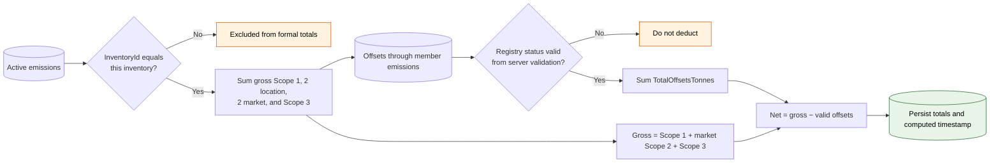
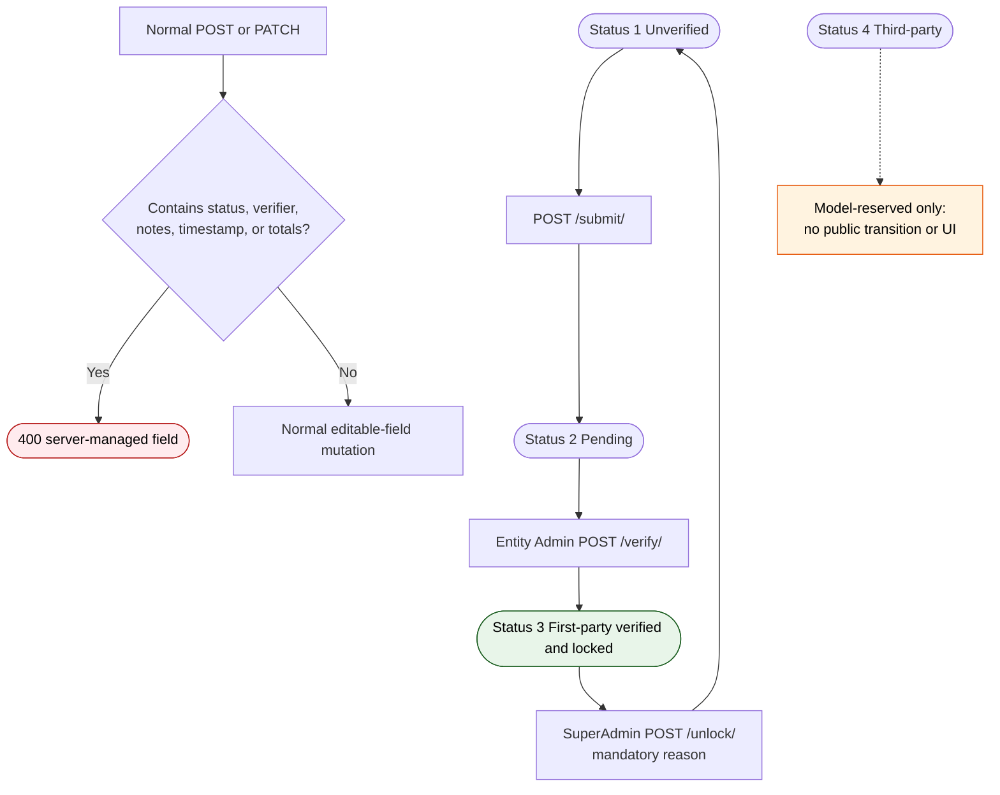
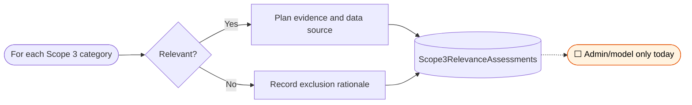
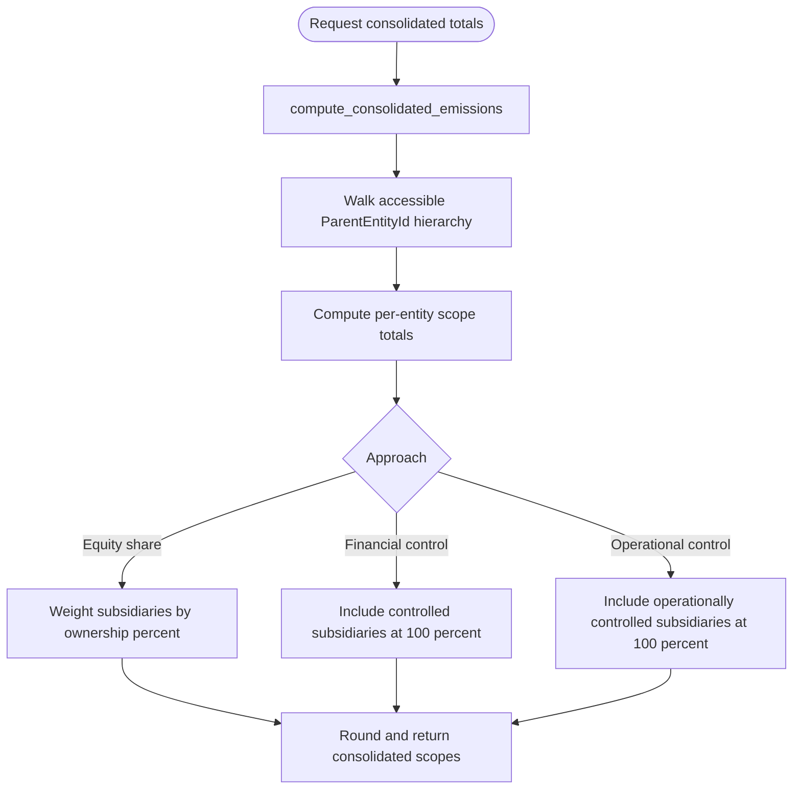

# BPMN 03 — GHG Inventory Close & Verification

The implemented annual assurance cycle: define a formal boundary, assign exact members,
reconcile unassigned work, recompute totals, verify through an authorised transition, and lock.

**Related user stories** — [Inventory & assurance — SDO-INV-01…14](../../stories/03-inventory-assurance.md) · [GHG accounting — SDO-GHG-10, 13, 14](../../stories/02-ghg-accounting.md)

**Linear traceability** — [SUS-19 · inventory contract](https://linear.app/susdevos/issue/SUS-19/cfi-002-make-ghg-inventory-creation-satisfy-its-data-contract) · [SUS-22 · tenant ownership](https://linear.app/susdevos/issue/SUS-22/cfi-006-enforce-tenant-ownership-on-every-critical-relationship) · [SUS-24 · authorised verification](https://linear.app/susdevos/issue/SUS-24/cfi-005-put-inventory-verification-behind-an-authorised-transition) · [SUS-25 · assignment flow](https://linear.app/susdevos/issue/SUS-25/cfi-008-connect-project-phases-and-inventory-assignment-end-to-end) · [SUS-33 · exact membership totals](https://linear.app/susdevos/issue/SUS-33/cfi-015-compute-formal-inventory-totals-from-explicit-inventory)

## Annual inventory process

```mermaid
flowchart TB
    subgraph L1["👤 Sustainability lead"]
        A([Open reporting inventory]) --> B[Enter reporting year and period]
        B --> C[Enter optional baseline year<br/>and boundary rationale]
        C --> D[Choose consolidation approach]
        D --> E[POST /api/ghg-inventories/]
    end

    subgraph L2["⚙️ System — establish the formal boundary"]
        E --> F{"Period, year, baseline valid?"}
        F -->|"No"| F1([400 field-specific error])
        F -->|"Yes"| G[Record active default GWP dataset]
        G --> H[(GHGInventories<br/>status 1 Unverified)]
        H --> I[(AuditLog Create)]
    end

    subgraph L3["👤 Staff — collect and assign"]
        I -.-> J[Create or edit emissions]
        J --> K{"Formal member?"}
        K -->|"Yes"| L[Select this InventoryId]
        K -->|"Not yet"| M[Leave as explicit<br/>unassigned working record]
    end

    subgraph L4["⚙️ API — membership validation"]
        L --> N{"Same entity, period inside boundary,<br/>same year and GWP dataset?"}
        N -->|"No"| N1([400 and no assignment])
        N -->|"Yes"| O[(EmissionsData.InventoryId<br/>exact membership persisted)]
        M --> P[(InventoryId = null)]
    end

    subgraph L5["👤 Sustainability lead — reconciliation"]
        O -.-> Q[GET /ghg-inventories/id/<br/>unassigned-emissions/]
        P -.-> Q
        Q --> R[Review period-matching candidates<br/>and records with incomplete dates]
        R --> S{"Assign any candidate?"}
        S -->|"Yes"| J
        S -->|"No — deliberately outside"| T[Prepare submission]
    end

    subgraph L6["⚙️ System — submit"]
        T --> U[POST /ghg-inventories/id/submit/]
        U --> V{"Unassigned review needed<br/>and not acknowledged?"}
        V -->|"Yes"| V1([409 unassigned_records_require_review])
        V -->|"No / acknowledged"| W[Recompute totals from exact InventoryId members]
        W --> X[(Audit acknowledgement and status 2 Pending)]
    end

    subgraph L7["🛡️ Entity Admin — first-party assurance"]
        X -.-> Y[Review boundary, evidence, and totals]
        Y --> Z[POST /ghg-inventories/id/verify/<br/>notes + optional acknowledgement]
    end

    subgraph L8["⚙️ System — verify and lock"]
        Z --> AA{"Entity Admin and status 2?"}
        AA -->|"No"| AA1([403 permission or<br/>409 invalid_transition])
        AA -->|"Yes"| AB[Repeat reconciliation gate]
        AB --> AC[Recompute exact-member totals again]
        AC --> AD[(status 3 First Party<br/>VerifiedBy · VerifiedAt · notes)]
        AD --> AE[(AuditLog Verify)]
        AE --> AF([🔒 Inventory and member writes locked])
    end

    V1 -.-> R

    style F1 fill:#ffebee,stroke:#b71c1c,color:#000
    style N1 fill:#ffebee,stroke:#b71c1c,color:#000
    style V1 fill:#fff3e0,stroke:#e65100,color:#000
    style AA1 fill:#ffebee,stroke:#b71c1c,color:#000
    style AF fill:#e8f5e9,stroke:#1b5e20,color:#000
```

`InventoryId` is the authoritative membership boundary. `EntityId + ReportingYear` is useful
for finding reconciliation candidates, but it never silently assigns a record and never drives
formal totals. The same-year isolation regression test covers two inventories plus unassigned
work and proves there is no cross-contamination.

## Exact-boundary totals

Totals are recomputed synchronously during both submit and verify. The 01:00 Celery task is a
freshness backstop for editable inventories; it skips `VerificationStatus >= 3`.

## Controlled assurance transition

There is currently no public rejection/send-back transition and no route into third-party
status `4`. The model value is retained for compatibility, but the product does not make an
assurance claim it cannot evidence.

## Scope 3 relevance assessment

GHG Protocol category relevance remains a documented gap rather than a fictional product flow.
`Scope3RelevanceAssessments` exists in the model/admin but has no REST serializer or endpoint;
mandatory exclusion justification is therefore not enforceable in the first-party UI. It is
tracked by [SUS-10](https://linear.app/susdevos/issue/SUS-10).

## Multi-entity consolidation

Formal inventory membership and group consolidation are separate operations. The group endpoint
walks the accessible entity hierarchy and applies the selected ownership/control approach; it
does not redefine which records belong to an individual formal inventory.

---
*Source: `frontend/src/app/(app)/inventories/page.tsx`,
`backend/apps/emissions/models.py`, `backend/apps/emissions/serializers.py`,
`backend/apps/emissions/views.py`, `backend/tasks/emissions.py`,
`backend/apps/entities/services.py`*
