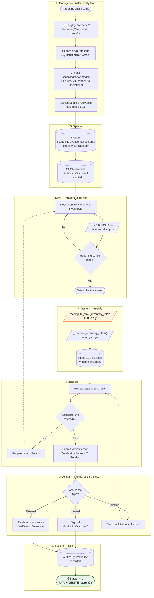
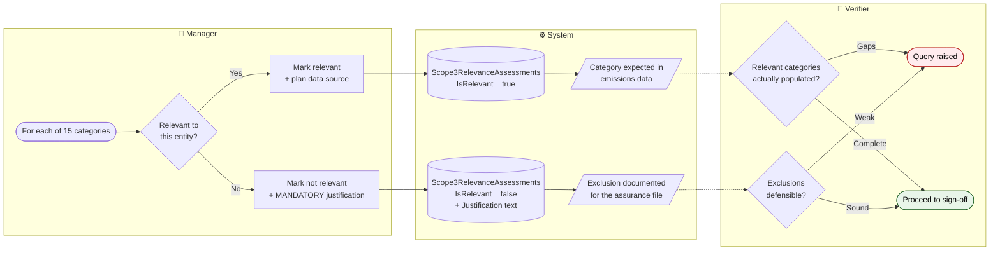
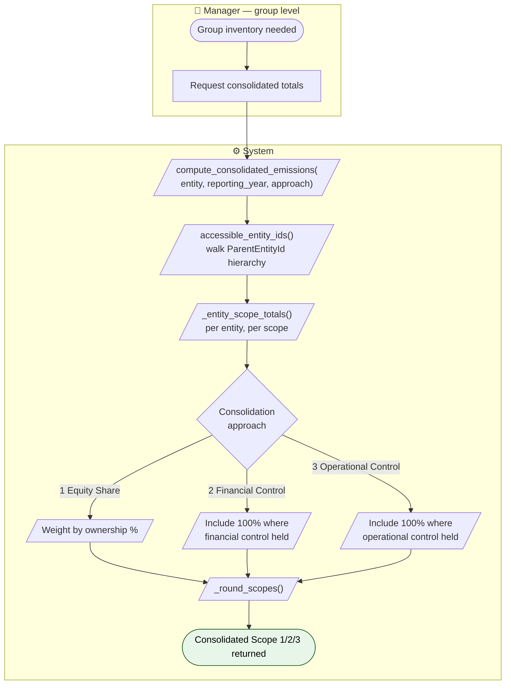

# BPMN 03 — GHG Inventory Close & Verification

The annual reporting cycle: open an inventory, assess Scope 3 relevance, accumulate records,
close, verify, and lock.

## Annual inventory process

The immutability check is a single comparison — `VerificationStatus >= 3` — so both the
first-party (3) and third-party (4) states are locked by the same guard. It is enforced in
the **view**, not the serializer.

## Scope 3 relevance assessment

GHG Protocol requires reporters to justify which of the 15 Scope 3 categories are material.
`Scope3RelevanceAssessments` is that record.

The justification field is what makes an omitted category auditable rather than simply absent.

## Multi-entity consolidation

For a parent entity with subsidiaries, totals are consolidated by the chosen approach.

`ConsolidationApproach` is stored on `Entities`, `DevelopmentProjects`, **and**
`GHGInventories` — the inventory's own value is the one that governs its reported figures,
allowing an entity to change approach between reporting years without rewriting history.

---
*Source: `backend/apps/emissions/models.py`, `backend/apps/emissions/views.py`,
`backend/apps/entities/services.py`, `backend/tasks/emissions.py`*
