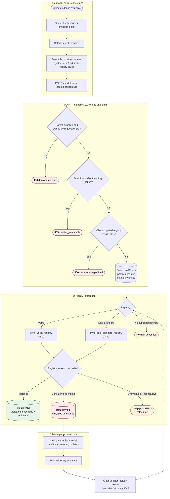
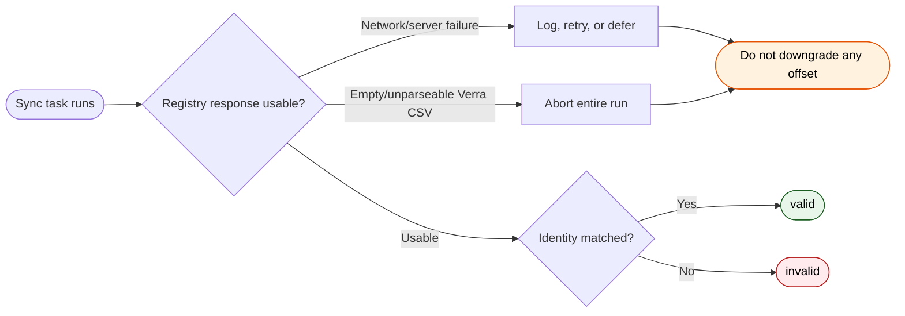
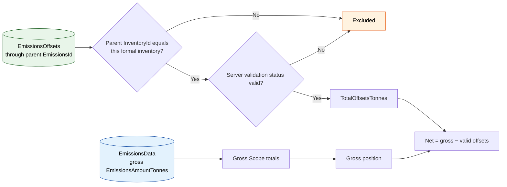

# BPMN 04 — Carbon Credit MRV & Registry Validation

How a user-declared offset is tied to an emissions record, kept separate from gross emissions,
and promoted to registry evidence only by the integration path.

**Related user stories** — [Nature & MRV — SDO-NAT-11…14](../../stories/04-nature-mrv.md) · [Inventory & assurance — SDO-INV-04, 14](../../stories/03-inventory-assurance.md)

**Linear traceability** — [SUS-31 · preserve the parent emission](https://linear.app/susdevos/issue/SUS-31/cfi-013-make-standalone-offset-creation-preserve-its-parent-emission) · [SUS-32 · prevent client self-validation](https://linear.app/susdevos/issue/SUS-32/cfi-014-prevent-clients-from-self-validating-carbon-offsets) · [SUS-22 · tenant-owned relationships](https://linear.app/susdevos/issue/SUS-22/cfi-006-enforce-tenant-ownership-on-every-critical-relationship) · [SUS-33 · exact inventory membership](https://linear.app/susdevos/issue/SUS-33/cfi-015-compute-formal-inventory-totals-from-explicit-inventory)

## Offset capture and validation

The parent relationship is required on standalone creation, tenant-scoped, and immutable after
creation. Nested creation binds the parent from the URL. A user can declare a registry identity,
but cannot declare validation status, timestamp, project/vintage metadata, or beneficiary.

SUS-32 remains in progress because registry **claim depth** still needs hardening and complete
tests: the Verra path matches an exact serial, while the Gold Standard path currently proves a
project endpoint exists and does not yet establish every retirement/ownership assertion needed
for full assurance.

## Failure semantics

An outage cannot masquerade as a fraudulent credit. `invalid` is written only after a usable,
registry-specific lookup produces a conclusive absence; unavailable or suspiciously empty data
leaves the prior status untouched.

## Where offsets sit relative to gross emissions

Offsets never mutate `EmissionsAmount`. They appear separately in formal inventory totals, and
only when their immutable parent emission is an explicit member of that inventory. Unassigned
or other same-year records cannot reduce the inventory's net figure.

## Scope boundary

MRV here means Verra / Gold Standard registry validation for the implemented product mandate.
There is no implied SBTi target validation, CDP export, NDC tagging, or RE100 workflow.

---
*Source: `frontend/src/app/(app)/offsets/page.tsx`,
`backend/apps/emissions/models.py`, `backend/apps/emissions/serializers.py`,
`backend/apps/emissions/views.py`, `backend/tasks/integrations/verra.py`,
`backend/tasks/integrations/gold_standard.py`, `backend/tasks/emissions.py`*
