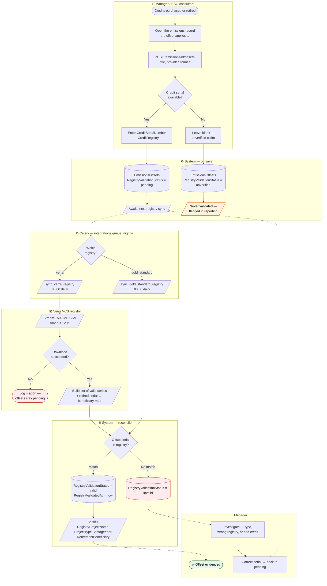
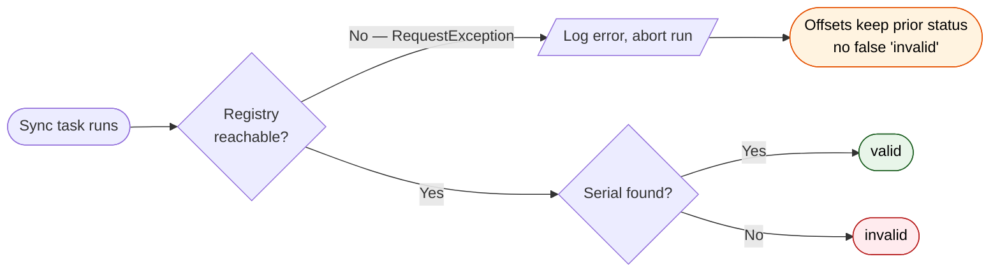
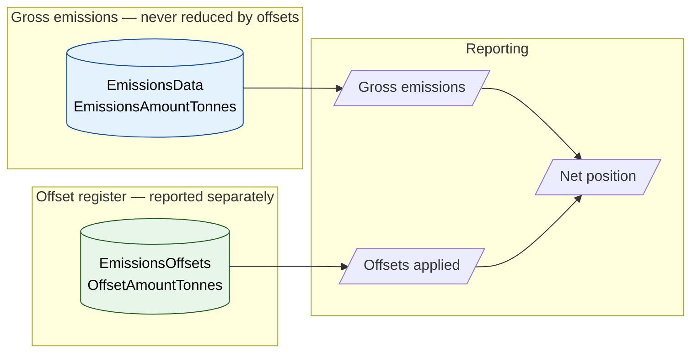

# BPMN 04 — Carbon Credit MRV & Registry Validation

How an offset claim is captured and then independently validated against the Verra or
Gold Standard registry. This is the MRV assurance loop.

## Offset capture and validation

**Design property worth noting in review:** validation is *asynchronous and external*. A
user can never mark their own credit valid — only a registry match sets `valid`. That is what
makes the offset column defensible in an assurance context.

## Failure semantics

An unreachable registry deliberately does **not** downgrade offsets to `invalid` — a network
outage must not look like a fraudulent credit. Status only moves to `invalid` on a successful
download where the serial is genuinely absent.

## Where offsets sit relative to gross emissions

Offsets are a **separate table joined to** the emissions record, not a deduction applied to
`EmissionsAmount`. Gross emissions stay gross — GHG Protocol requires offsets to be reported
separately rather than netted into the inventory total. This mirrors the biogenic CO₂
treatment in `EmissionsData`, where the biogenic figure is likewise held apart from the
GWP total.

## Scope boundary

Per `CLAUDE.md`, MRV here means **Verra / Gold Standard credit validation** only. There is
deliberately no SBTi target validation, no CDP questionnaire export, and no NDC tagging —
if a spec document describes those, the document is stale, not a backlog item.

---
*Source: `backend/apps/emissions/models.py`, `backend/tasks/integrations/verra.py`,
`backend/tasks/integrations/gold_standard.py`, `backend/config/celery.py`*
