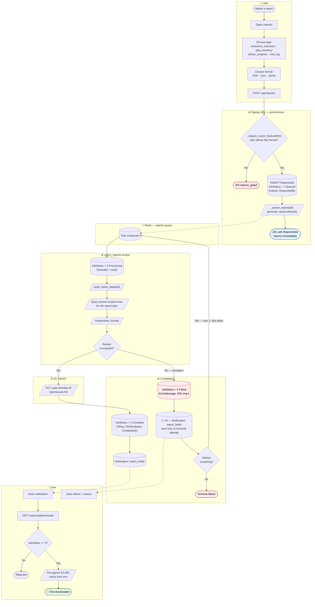
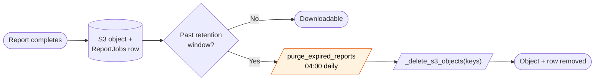
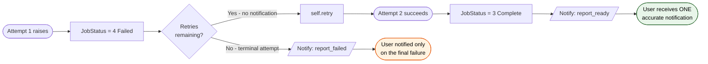

# BPMN 05 — Report Generation & Delivery

The only user-triggered asynchronous process in the platform. Everything else in the
request path is synchronous.

**Related user stories** — [Reporting & notifications — SDO-REP-01…08](../../stories/05-reporting-notifications.md)

## Process

## Timing and resource constraints

| Constraint | Value | Reason |
|------------|-------|--------|
| `time_limit` | 300s | Hard kill — a runaway PDF render must not occupy a worker |
| `max_retries` | 2 | Transient S3/DB faults recover; deterministic render bugs do not |
| `default_retry_delay` | 60s | Space out retries against a recovering dependency |
| `--max-tasks-per-child` | 10 | Recycle workers — PDF rendering accumulates memory |
| Worker concurrency | 2 | Reports are memory-heavy; a narrow queue protects the box |

## Retention

## ✅ F4 · Failure notification ordering — fixed

> The worker used to mark the job `Failed` **and send `report_failed`** before calling
> `self.retry()` (`backend/tasks/reports.py:65-68`) — so a job that succeeded on its second
> attempt had already told the user it failed, then later told them it was ready, and they
> could re-request a report that was already in flight.
> **Now:** `_notify_failed()` fires only once `self.request.retries >= self.max_retries`,
> deferring the notification to the terminal attempt. The `JobStatus = 4` write still happens
> on every attempt — "Failed" is an honest description of the job's state between attempts; it
> was only the *notification* that was premature. Three tests cover retries-remaining, the
> terminal attempt, and the happy path.
> See [F4 in the findings register](../FINDINGS.md#f4).

## Local development note

`_upload_to_storage()` branches on settings: S3/MinIO in normal operation, a `/tmp` write in
development. A report generated in a local container therefore lands inside that container's
filesystem, not in MinIO, unless S3 storage is enabled in the environment.

---
*Source: `backend/tasks/reports.py`, `backend/apps/reports/views.py`,
`backend/apps/reports/models.py`, `backend/apps/reports/renderers.py`,
`backend/config/celery.py`*
