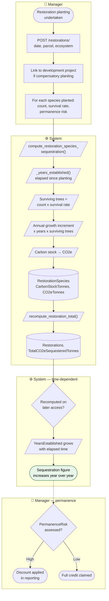
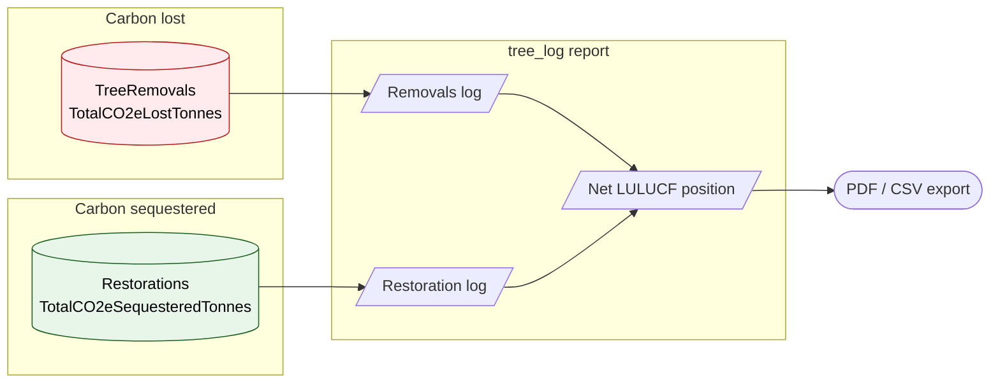
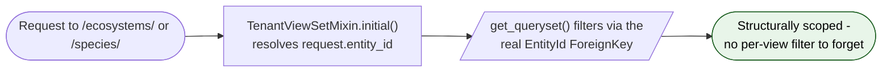

# BPMN 06 — Nature Tracking: Removals & Restoration

The LULUCF / TNFD side of the platform: recording biomass carbon lost to tree removal and
gained through restoration planting.

## Tree removal — carbon stock loss

```mermaid
flowchart TB
    subgraph L1["👤 Manager — project manager"]
        A([Trees to be removed<br/>for development work]) --> B[Create land parcel<br/>if not already recorded]
        B --> C[POST /tree-removals/<br/>date, project, parcel]
        C --> D[For each species removed:<br/>species, tree count, DBH, height]
    end

    subgraph L2["⚙️ System — species resolution"]
        D --> E{"Species already<br/>in the catalogue?"}
        E -->|"No"| F[/"GBIF lookup —<br/>taxonomy + canonical name"/]
        F --> G[/"IUCN Red List —<br/>conservation status"/]
        G --> H[("INSERT Species<br/>IUCNStatus, IPCCForestType")]
        E -->|"Yes"| I[Reuse existing row]
        H --> I
    end

    subgraph L3["⚙️ System — IPCC biomass calculation"]
        I --> J[/"compute_removed_species_carbon()"/]
        J --> K[/"_param(species, attr, forest_default)<br/>species value, else IPCC default<br/>for its forest type"/]
        K --> L[/"Above-ground biomass<br/>allometric or per-tree default"/]
        L --> M[/"Below-ground biomass<br/>x root-to-shoot ratio"/]
        M --> N[/"Carbon stock<br/>x carbon fraction"/]
        N --> O[/"CO2e = carbon x 44/12"/]
        O --> P[("TreeRemovalRemovedSpecies<br/>biomass, carbon, CO2e")]
        P --> Q[/"recompute_tree_removal_total()<br/>_sum_lulucf()"/]
        Q --> R[("TreeRemovals.<br/>TotalCO2eLostTonnes")]
    end

    subgraph L4["👤 Manager — TNFD impact"]
        R -.-> S[Record affected species<br/>not removed but impacted]
        S --> T[("TreeRemovalAffectedSpecies<br/>ecological impact, no carbon figure")]
        T --> U{"Threatened species<br/>IUCN CR/EN/VU?"}
        U -->|"Yes"| V([⚠️ Flagged for<br/>biodiversity reporting])
        U -->|"No"| W([Standard record])
    end

    style F fill:#fff3e0,stroke:#e65100,color:#000
    style G fill:#fff3e0,stroke:#e65100,color:#000
    style V fill:#ffebee,stroke:#b71c1c,color:#000
```

The **removed vs affected** split is the TNFD-relevant distinction: removed species carry the
carbon computation, affected species record ecological impact without a carbon figure.

## Restoration — sequestration

**Important asymmetry.** Removal carbon is a one-off stock loss fixed at the removal date.
Restoration sequestration is a *function of elapsed time* — `_years_established()` recomputes
from the planting date, so the same restoration row reports a larger figure each year. Any
reviewer comparing the two must not treat them as symmetric quantities.

## Combined nature balance

The `tree_log` report type in `ReportJobs.REPORT_TYPE_CHOICES` is what surfaces this
combined view.

## Tenant isolation — now structural

`Ecosystem.EntityId` and `Species.EntityId` are now real `ForeignKey`s
(`db_column="EntityId"` keeps the existing column), so both viewsets use the full
`TenantViewSetMixin` and scoping is enforced structurally rather than by convention.

> **✅ F1 · Tenant isolation — real foreign key, structural enforcement — fixed 2026-08-21.**
> `EntityId` used to be a plain `IntegerField` (`apps/ecosystem/models.py:27,52`) rather than a
> `ForeignKey`, so `TenantViewSetMixin` could not filter these models and each viewset had to
> filter for itself — a new endpoint that omitted the filter would have returned every
> tenant's species and ecosystems, silently and with no exception.
> **Now:** both fields are `models.ForeignKey("entities.Entities", on_delete=models.PROTECT,
> db_column="EntityId")`. `db_column` keeps the existing column, so the migration is
> `AlterField` only — no rename, no data migration. Both viewsets now use
> `TenantViewSetMixin`, which also gained them audit logging they previously had none of.
> `apps/ecosystem/tests/test_tenant_scope.py` and
> `apps/land/tests/test_ecosystem_link_isolation.py` remain as regression tests.
> See [F1 in the findings register](../FINDINGS.md#f1).

---
*Source: `backend/apps/restorations/models.py`, `backend/apps/restorations/services.py`,
`backend/apps/ecosystem/models.py`, `backend/apps/ecosystem/integrations.py`,
`backend/apps/ecosystem/views.py`, `backend/apps/land/models.py`*
