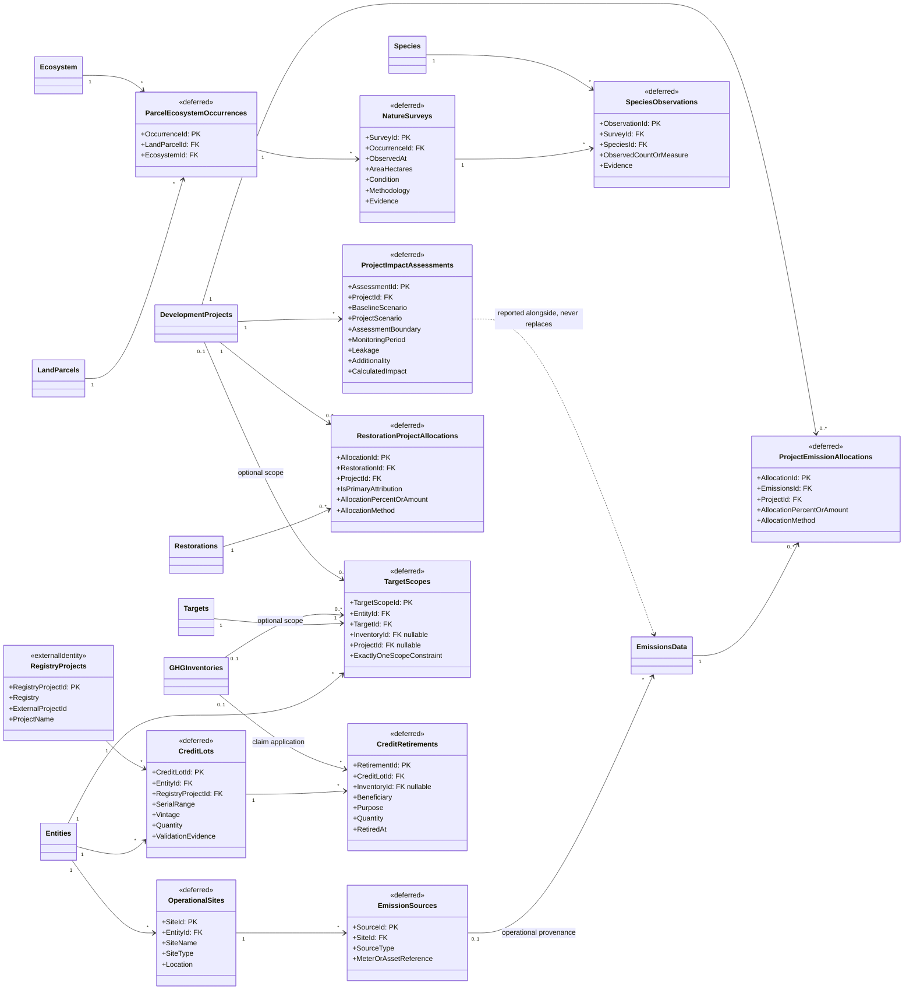

# Proposed UML 01 — Project-Centric Workspace and Hybrid Ownership

**Design state:** Proposed — not implemented  
**Decision:** [ADR 0001](../../decisions/0001-project-centric-workspace.md)  
**Related user stories:** [SDO-PRJ-01…08](../../stories/08-project-workspace.md)  
**Current-state references:** [UML 03 — GHG](../uml/03-domain-ghg.md) ·
[UML 04 — Nature & MRV](../uml/04-domain-nature-mrv.md)

This document is a design gate. The first diagram composes existing relationships into a
project workspace without changing database ownership. The second records deferred schema
concepts that must **not** be smuggled into the first implementation slice.

## Immediate target — existing records, project-centric read model

```mermaid
classDiagram
    direction TB

    class Entities {
        +EntityId: PK
        +Name
        +ConsolidationApproach
    }

    class DevelopmentProjects {
        +ProjectId: PK
        +EntityId: FK PROTECT
        +ProjectName
        +StartDate
        +EndDate
        +Status
    }

    class ProjectPhases {
        +PhaseId: PK
        +ProjectId: FK CASCADE
        +EntityId: FK PROTECT
        +PhaseName
        +StartDate
        +EndDate
    }

    class ProjectWorkspace {
        <<readModel>>
        +ProjectId
        +Overview
        +Phases
        +Emissions
        +SitesAndParcels
        +NatureInterventions
        +Reports
    }

    class GHGInventories {
        +InventoryId: PK
        +EntityId: FK PROTECT
        +ReportingPeriod
        +BoundaryNotes
        +VerificationStatus
    }

    class EmissionsData {
        +EmissionsId: PK
        +EntityId: FK PROTECT
        +InventoryId: FK SET_NULL nullable
        +ProjectId: FK SET_NULL nullable
        +PhaseId: FK SET_NULL nullable
        +ReportingPeriod
        +SourceObservations
        +CalculatedAmounts
    }

    class LandParcels {
        +LandParcelId: PK
        +EntityId: FK PROTECT
        +ParcelName
        +BoundaryGeoJSON
        +AreaHectares
    }

    class DevelopmentProjectLandParcels {
        <<junction>>
        +ProjectId: FK CASCADE
        +LandParcelId: FK CASCADE
    }

    class Ecosystem {
        +EcosystemId: PK
        +EntityId: FK PROTECT
        +EcosystemName
        +EcosystemType
    }

    class Species {
        +SpeciesId: PK
        +EntityId: FK PROTECT
        +ScientificName
        +IUCNStatus
        +BiomassParameters
    }

    class LandParcelEcosystems {
        <<junction>>
        +LandParcelId: FK CASCADE
        +EcosystemId: FK CASCADE
    }

    class TreeRemovals {
        +TreeRemovalId: PK
        +EntityId: FK PROTECT
        +ProjectId: FK SET_NULL nullable
        +RemovalDate
        +CalculatedCarbonLoss
    }

    class TreeRemovalLandParcels {
        <<junction>>
        +TreeRemovalId: FK CASCADE
        +LandParcelId: FK CASCADE
    }

    class Restorations {
        +RestorationId: PK
        +EntityId: FK PROTECT
        +RestorationName
        +StartDate
        +CalculatedSequestration
    }

    class RestorationDevelopmentProjects {
        <<junction>>
        +RestorationId: FK CASCADE
        +ProjectId: FK CASCADE
    }

    class RestorationLandParcels {
        <<junction>>
        +RestorationId: FK CASCADE
        +LandParcelId: FK CASCADE
    }

    class Targets {
        +TargetId: PK
        +EntityId: FK PROTECT
        +TargetName
        +BaselineYear
        +TargetYear
    }

    class EmissionsOffsets {
        +OffsetId: PK
        +EmissionsId: FK CASCADE
        +OffsetAmountTonnes
        +RegistryProjectName
        +RegistryValidationStatus
    }

    class ProjectReportRequest {
        <<requestDTO>>
        +ProjectId: required
        +PeriodFrom: conditional
        +PeriodTo: conditional
        +InventoryId: optional
        +AsOfDate: derived from PeriodTo
    }

    class ProjectReportView {
        <<readModel>>
        +AttributedOperationalEmissions
        +BiomassStockLoss
        +RestorationEstimateAsOf
        +AttachedOffsets
        +BoundaryDisclosure
    }

    class ReportJobs {
        +ReportJobId: PK
        +EntityId: FK PROTECT
        +ReportType
        +Parameters: JSON
        +JobStatus
    }

    Entities "1" --> "*" DevelopmentProjects : owns
    Entities "1" --> "*" GHGInventories : assures
    Entities "1" --> "*" EmissionsData : owns
    Entities "1" --> "*" LandParcels : owns
    Entities "1" --> "*" Ecosystem : catalogues
    Entities "1" --> "*" Species : catalogues
    Entities "1" --> "*" TreeRemovals : owns
    Entities "1" --> "*" Restorations : owns
    Entities "1" --> "*" Targets : owns
    Entities "1" --> "*" ReportJobs : requests

    DevelopmentProjects "1" --> "*" ProjectPhases : contains
    GHGInventories "0..1" --> "*" EmissionsData : explicit membership
    DevelopmentProjects "0..1" --> "*" EmissionsData : optional attribution
    ProjectPhases "0..1" --> "*" EmissionsData : optional attribution
    EmissionsData "1" --> "0..*" EmissionsOffsets : current attachment

    DevelopmentProjects "1" --> "*" DevelopmentProjectLandParcels
    LandParcels "1" --> "*" DevelopmentProjectLandParcels
    LandParcels "1" --> "*" LandParcelEcosystems
    Ecosystem "1" --> "*" LandParcelEcosystems

    DevelopmentProjects "0..1" --> "*" TreeRemovals : optional context
    TreeRemovals "1" --> "1..*" TreeRemovalLandParcels : required by target flow
    LandParcels "1" --> "*" TreeRemovalLandParcels

    Restorations "1" --> "0..*" RestorationDevelopmentProjects
    DevelopmentProjects "1" --> "*" RestorationDevelopmentProjects
    Restorations "1" --> "1..*" RestorationLandParcels : required by target flow
    LandParcels "1" --> "*" RestorationLandParcels

    ProjectWorkspace ..> DevelopmentProjects : selected context
    ProjectWorkspace ..> ProjectPhases : manages
    ProjectWorkspace ..> EmissionsData : filters by ProjectId
    ProjectWorkspace ..> LandParcels : follows junction
    ProjectWorkspace ..> TreeRemovals : filters by ProjectId
    ProjectWorkspace ..> Restorations : follows junction
    ProjectWorkspace ..> ProjectReportRequest : supplies boundary
    ProjectReportRequest ..> ReportJobs : becomes Parameters
    ReportJobs ..> ProjectReportView : produces separated measures
```

### Invariants expressed by the model

- `ProjectWorkspace` is not persisted and owns no canonical record.
- Inventory membership and project attribution are independent nullable relationships on an
  emission. A project selection cannot add or remove an inventory member.
- A land parcel remains entity-owned even when linked to several projects.
- The target workflow requires a parcel for removals/restorations, although the current
  database junctions do not yet enforce a minimum count.
- Targets remain entity-owned in the immediate slice; the UI must not call them project
  targets until a real scoped-target relation exists.
- Reports receive an explicit project parameter; they do not infer a project from the
  user's current screen or include all entity data silently.
- A formal report receives a date range or an inventory whose dates become that range; its nature
  as-of date is the range end. A workspace overview may show lifetime-to-date figures only when
  labelled explicitly.
- Operational emissions, biomass stock loss, restoration estimates, and attached offsets are
  displayed separately; the read model defines no automatic net-carbon formula.
- A restoration's current many-to-many project relation is attribution, not allocation. A shared
  restoration may be visible in several workspaces but cannot be summed repeatedly in a portfolio
  result without an approved allocation method.
- First-slice capture selects zero or one project for a new nature event. It does not expose the
  current restoration junction as a multi-select or pretend that one link is an allocation.
- Current offsets remain children of emissions. A project workspace may follow that relationship
  but cannot describe those rows as a complete holding/retirement ledger.

## Deferred target — gaps that need separate schema decisions

### Why these classes are deferred

They solve real modelling problems, but none is necessary to prove that a project workspace
improves usability. Implementing them together would turn a navigation change into a large,
irreversible data migration. Each needs its own source-data contract, migration plan, and
user validation.

In particular, `ProjectImpactAssessments` must not write into `EmissionsData` totals, and
`CreditRetirements` must not silently reduce gross inventory emissions. Their results can be
reported alongside inventory actuals with explicit labels and claims.

---

*Current sources: `backend/apps/projects/models.py`, `backend/apps/emissions/models.py`,
`backend/apps/land/models.py`, `backend/apps/ecosystem/models.py`,
`backend/apps/restorations/models.py`, `backend/apps/reports/models.py`. Proposed classes have
no code source and are intentionally labelled deferred.*
