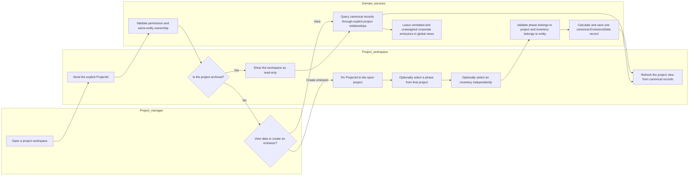
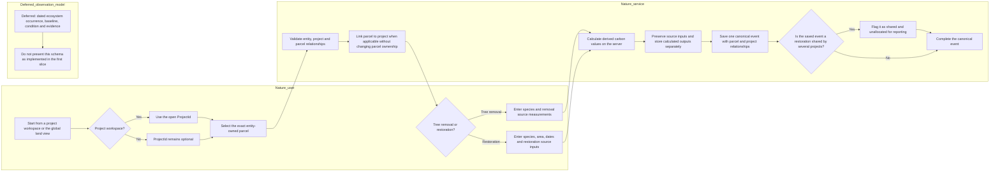
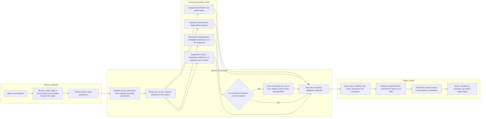
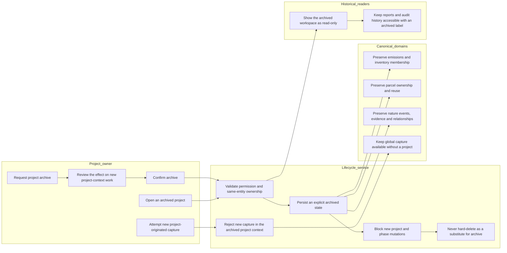

# Proposed BPMN 02 — Project-Centric User Flows

> **Design state: Proposed — not implemented.** These flows are a design gate, not a
> description of current application behaviour.

**Decision:** [ADR 0001](../../decisions/0001-project-centric-workspace.md)  
**Target domain model:** [Proposed UML 01](01-project-centric-workspace-uml.md)  
**Acceptance contracts:** [SDO-PRJ-01…08](../../stories/08-project-workspace.md)

The Mermaid flowcharts use subgraphs as lightweight swimlanes. They deliberately keep
project attribution, inventory membership, and location as separate axes. A project
workspace composes existing canonical records; it does not create a second project-owned
copy of them.

## 1. Project workspace and project-originated capture

`ProjectId` is fixed only because this capture began inside the project workspace. The
optional `InventoryId` still controls formal inventory membership; the workspace cannot
assign it implicitly. Emissions created globally without a project remain valid and do not
appear in this project view.

## 2. Global and inventory-originated emissions capture

```mermaid
flowchart LR
    subgraph Sustainability_manager
        direction TB
        GI1["Start emissions capture"]
        GI2{"Started inside an inventory?"}
    end

    subgraph Capture_form
        direction TB
        GI3["Global route: InventoryId optional"]
        GI4["Inventory route: fix the selected InventoryId"]
        GI5["Choose an optional ProjectId independently"]
        GI6{"Was a project selected?"}
        GI7["Optionally choose a phase from that project"]
        GI8["Continue with no project"]
    end

    subgraph Domain_service
        direction TB
        GI9["Validate every supplied identifier against the same entity"]
        GI10["Calculate and save one canonical emissions record"]
        GI11{"Does the record have an InventoryId?"}
        GI12["Include it as an exact inventory member"]
        GI13["Keep it outside formal inventory totals"]
    end

    subgraph Assurance_process
        direction TB
        GI14["Verify and lock the exact inventory membership"]
        GI15["Treat project only as attribution and filtering"]
    end

    GI1 --> GI2
    GI2 -->|No| GI3 --> GI5
    GI2 -->|Yes| GI4 --> GI5
    GI5 --> GI6
    GI6 -->|Yes| GI7 --> GI9
    GI6 -->|No| GI8 --> GI9
    GI9 --> GI10 --> GI11
    GI11 -->|Yes| GI12 --> GI14 --> GI15
    GI11 -->|No| GI13
```

The absence of `ProjectId` is not a validation error. Inventory and project are orthogonal:
an inventory may contain records from several projects and ordinary operations, while a
project may have records inside and outside a particular inventory.

## 3. Parcel and nature-intervention capture

A parcel is required for these nature events because it is the durable spatial boundary.
The project link supplies operational context and can coexist with other project links; it
does not transfer or duplicate the parcel. The disconnected deferred lane is intentional:
dated ecosystem observations and baselines require a separate approved schema.

## 4. Project reporting with explicit accounting boundaries

The first slice may show existing offset or retirement evidence, but it must not infer a
verified retirement or a credit ledger that does not exist. Gross operational emissions,
biomass loss, restoration estimates, and credit claims have different units, time bases, and
assurance status; they are reported alongside one another and never silently netted.

## 5. Project archive and historical continuity

Archive is a lifecycle state, not cascading deletion. If the current model cannot represent
that state reliably, the archive mutation needs a separate schema decision; the product must
not simulate archive by deleting the project or severing its canonical relationships.

## Exception and guardrail matrix

| Flow | Condition | Required outcome |
|---|---|---|
| Workspace or report | Project is missing, inaccessible, or belongs to another entity | Return not found; do not reveal cross-tenant existence or related counts. |
| Project capture | Project is archived | Render existing data read-only and reject new project-context writes. |
| Emissions capture | Phase does not belong to selected project | Reject before calculation or persistence. |
| Emissions capture | Inventory belongs to another entity or is locked | Reject the assignment; preserve existing inventory verification rules. |
| Global capture | No project selected | Accept it as valid corporate activity data. |
| Nature capture | No exact parcel selected | Reject the event; never use the project itself as a spatial substitute. |
| Nature capture | Parcel belongs to another entity | Reject it even if a supplied project identifier is valid. |
| Project report | Neither a complete date range nor an inventory is supplied | Reject the request before creating a report job; never default a formal report silently to all time. |
| Project report | Restoration is attributed to more than one project | Show it as shared and unallocated; exclude it from additive project totals until an approved allocation method exists. |
| Project report | Offset exists without reliable retirement evidence | Label only what the evidence supports; do not call it a retired credit. |
| Any flow | Project relation is absent from an otherwise valid global record | Do not place it in a generic error queue or invent a synthetic project. |

## First-slice and deferred boundary

| First slice using existing relationships | Deliberately deferred pending a separate design decision |
|---|---|
| Derived project workspace over canonical records | Operational site, facility, source, meter or asset schema |
| Project-context preselection with entity and phase validation | Dated ecosystem occurrence, baseline, condition and observation history |
| Global and inventory capture with optional project attribution | Counterfactual project-impact accounting and avoided-emissions claims |
| Parcel-first removal and restoration capture with zero or one project selected for a new event | Multi-project amount or percentage allocation engine |
| Explicitly bounded project reports with separated categories | Credit-lot, holding and retirement ledger |
| Read-only archive contract without deletion | Scoped project, inventory and entity targets |

The archive contract belongs in acceptance tests before release. If a reliable archived state
cannot be represented without a migration, that mutation moves to the deferred column while
read-only historical continuity remains a non-negotiable constraint on the eventual design.

---

*Current process references: [Emissions lifecycle](../bpmn/02-emissions-lifecycle.md),
[Inventory verification](../bpmn/03-inventory-verification.md),
[Report generation](../bpmn/05-report-generation.md), and
[Nature tracking](../bpmn/06-nature-tracking.md).*
