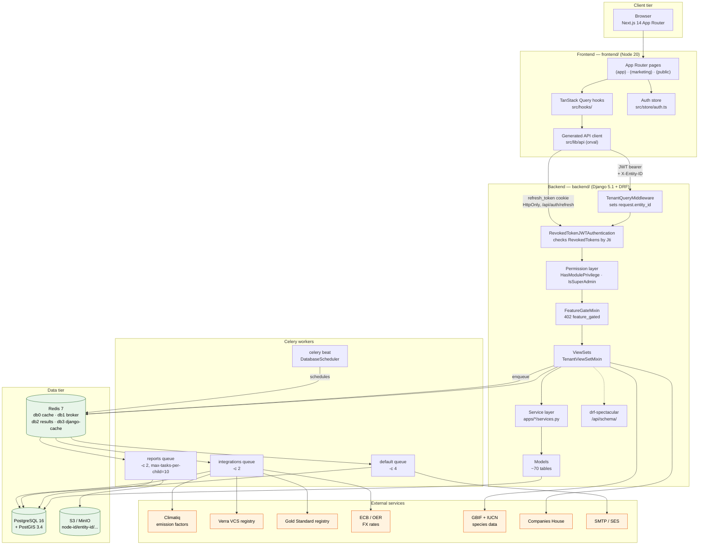
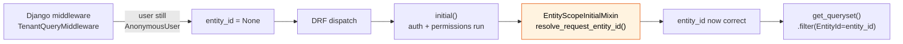

# 01 — Component & Deployment Architecture

How the running system is composed. Everything inside **SusDevOS Platform** is code in this
repo; everything in **External Services** is a third party reached over HTTPS.

**Related user stories** — [Billing & platform — SDO-BIL-12, 13](../../stories/06-billing-platform.md)

## Request pipeline order — and why it matters

`TenantQueryMiddleware` is **Django** middleware, so it runs *before* DRF authenticates the
request. On a JWT request `request.user` is still anonymous at middleware time, so the
middleware cannot resolve the entity. Every tenant-scoped view therefore re-resolves it:

Omitting `EntityScopeInitialMixin` on a tenant-scoped view does not raise — it silently
yields `entity_id is None`, which produces empty reads and NOT-NULL violations on create.

## Deployment topology (local)

| Service | Image / runtime | Host port | Notes |
|---------|-----------------|-----------|-------|
| `db` | `postgis/postgis:16-3.4` | *none* | Internal only — reachable as `db:5432` |
| `redis` | `redis:7-alpine` | 6379 | 4 logical DBs |
| `minio` | `minio/minio:latest` | 9000 / 9001 | S3 API / console |
| `api` | `backend/Dockerfile` | 8000 | `runserver`, `config.settings.local` |
| `celery_worker` | `backend/Dockerfile` | — | `default` queue |
| `celery_integrations` | `backend/Dockerfile` | — | `integrations` queue |
| `celery_reports` | `backend/Dockerfile` | — | `reports` queue |
| `celery_beat` | `backend/Dockerfile` | — | `django_celery_beat` DatabaseScheduler |
| frontend | Node 20 on host | 3000 | Not containerised for dev |

`db` deliberately publishes no host port — 5432/5433 are occupied by other local databases.
Backend processes must run inside the compose network to reach it.

---
*Source: `docker-compose.yml`, `backend/config/settings/`, `backend/config/celery.py`,
`backend/apps/entities/middleware.py`, `backend/apps/shared/views.py`,
`backend/apps/users/authentication.py`, `frontend/src/`*
