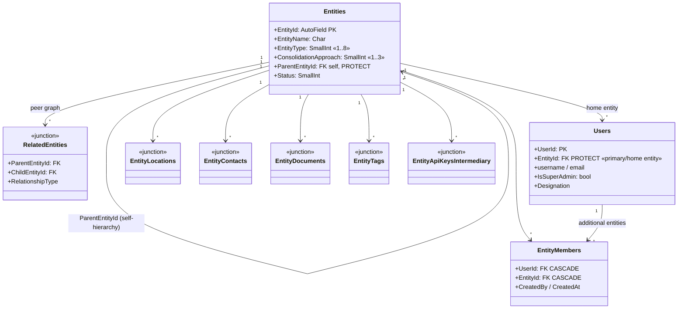
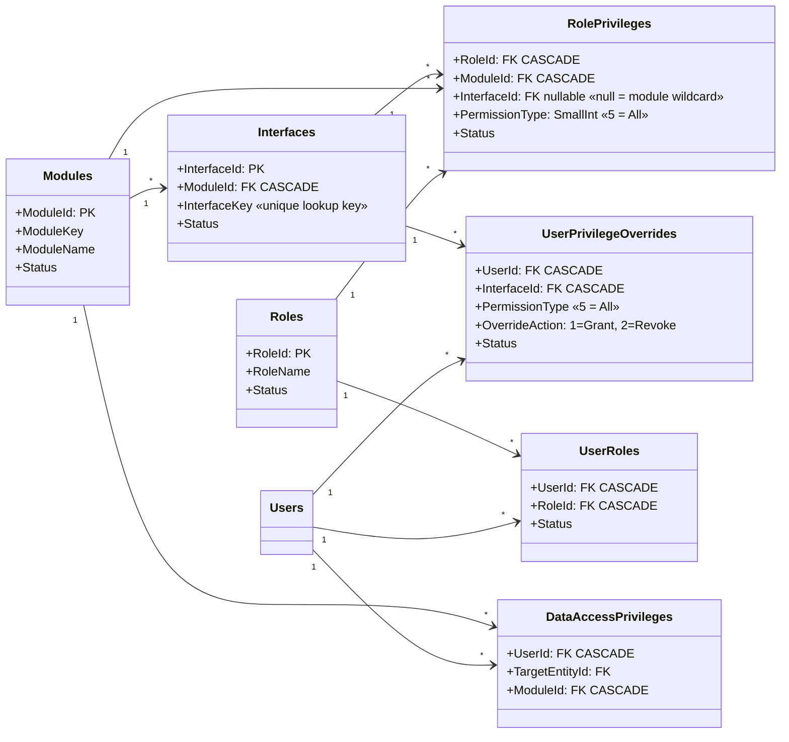
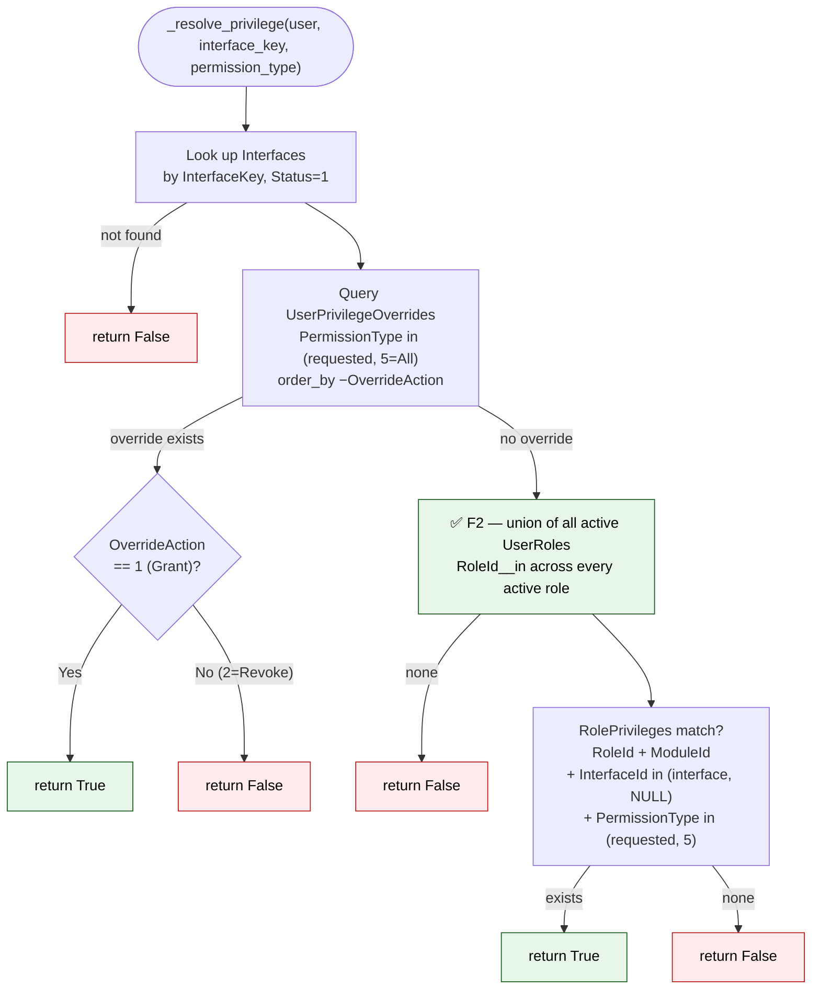
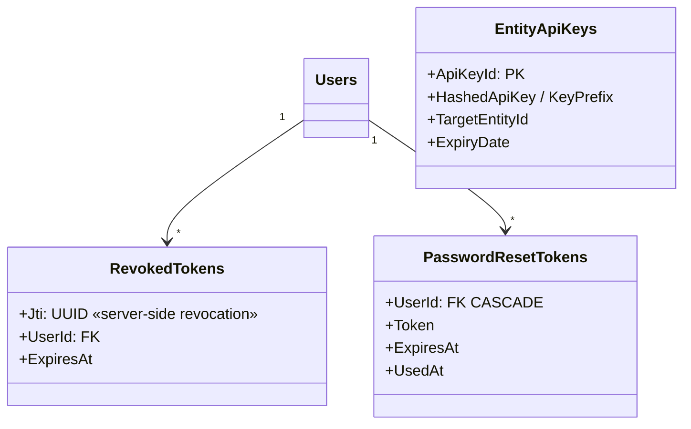

# 02 — Tenancy & RBAC Domain Model

The multi-tenancy root (`Entities`) and the privilege system that governs every request.

**Related user stories** — [Tenancy & access — SDO-TEN-01…16](../../stories/01-tenancy-access.md)

## Tenancy

A user has exactly one **home** entity (`Users.EntityId`) and zero or more **additional**
entities via `EntityMembers`. That is what makes an ESG consultant serving several clients
possible without duplicating the user.

## RBAC — Modules → Interfaces → RolePrivileges

### Privilege resolution algorithm

Implemented in `_resolve_privilege()`. The order is significant — overrides short-circuit
roles entirely, and a Revoke beats a Grant at the same level.

**`ORDER BY -OverrideAction` is load-bearing.** `2` (Revoke) sorts before `1` (Grant), so a
Revoke wins when both exist. The `.first()` depends on that ordering — this is correct, but
it is not obvious, and removing the ordering would silently invert the precedence.

> **✅ F2 · Authorization — union across active roles — fixed 2026-08-21.**
> `apps/shared/permissions.py:89` used to read `UserRoles.objects.filter(...).first()` with
> **no `order_by`**. `UserRoles` is a many-to-many table, so a user could hold several active
> roles, but privileges were not the union of them — one arbitrary role won, and a user granted
> both `Manager` and a narrow custom role could silently lose their Manager privileges, with the
> effective role able to change after a table rewrite with no data change at all.
> **Now:** `_resolve_privilege` unions across every active role (`RoleId__in=role_ids`),
> matching what `IsEntityAdmin`/`IsManagerOrAbove` already did. No `UniqueConstraint` was added
> — deliberately, since the union makes multi-role well-defined and such a migration could fail
> against pre-existing duplicate rows. `assign_role` now runs inside `transaction.atomic()` so
> its retire-then-create pair cannot interleave.
> See [F2 in the findings register](../FINDINGS.md#f2).

`build_privilege_map()` returns a flat `{interface_key: bool}` for `GET /auth/me`, which
populates the frontend Zustand store. SuperAdmin bypasses the whole algorithm.

## Token & credential models

Access tokens are 15-minute JWTs held in memory; the 7-day refresh token is an HttpOnly
cookie scoped to `Path=/api/auth/refresh`. Logout writes the `Jti` into `RevokedTokens`,
which `RevokedTokenJWTAuthentication` checks on every request — so revocation is immediate
rather than waiting for expiry.

---
*Source: `backend/apps/entities/models.py`, `backend/apps/users/models.py`,
`backend/apps/shared/permissions.py`, `backend/apps/users/authentication.py`*
