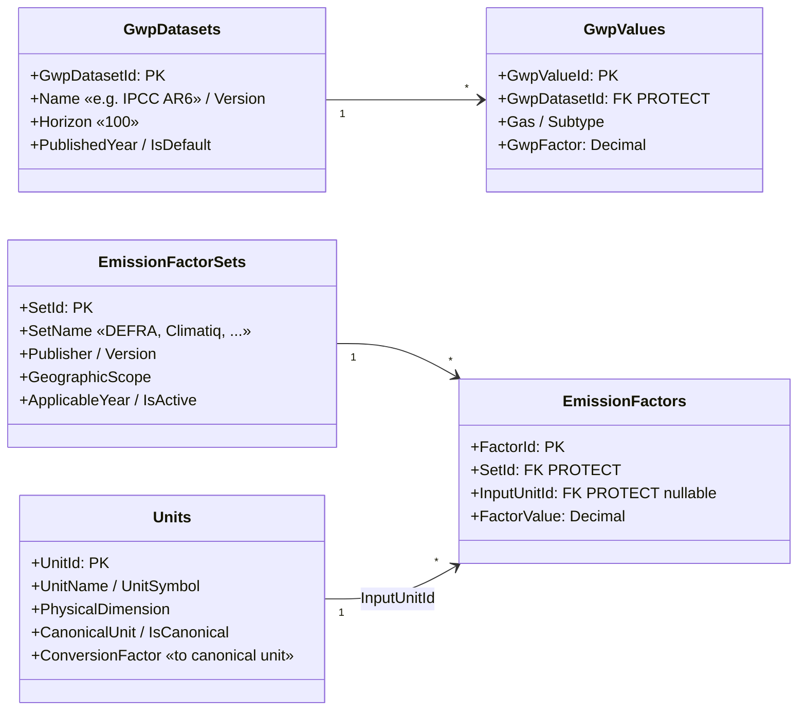
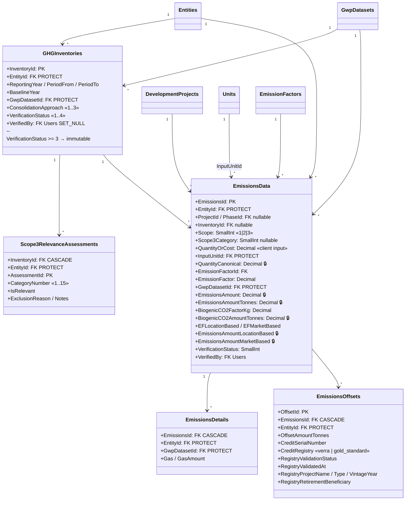
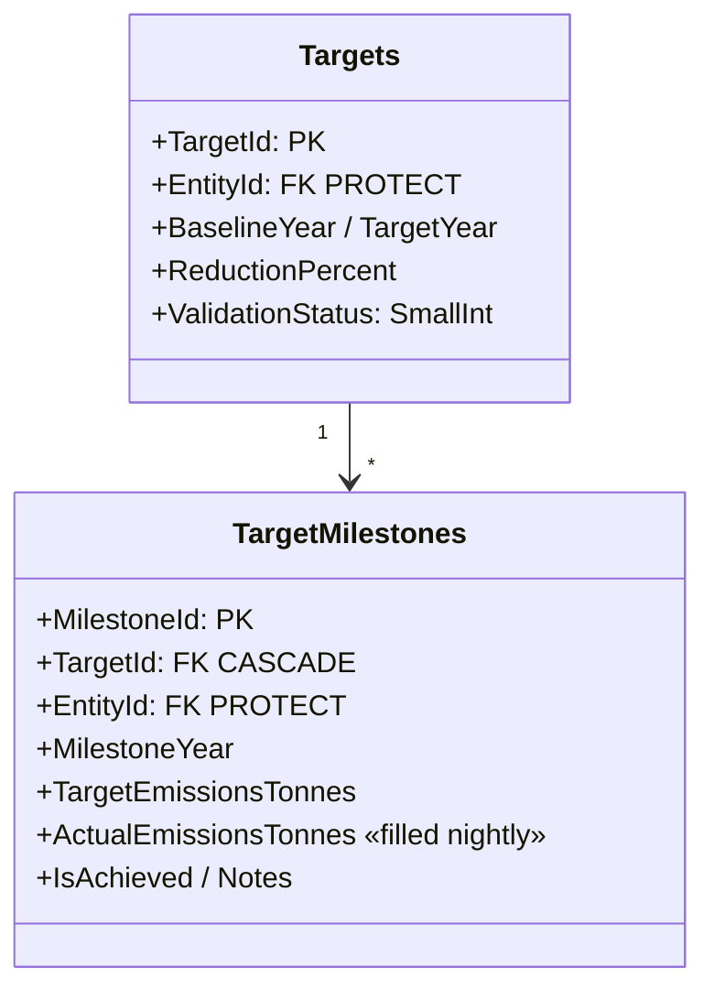
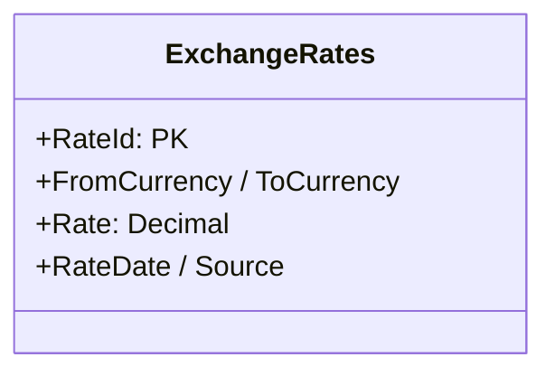

# 03 — GHG Accounting Domain Model

The emissions core: reference data (units, factors, GWP), the inventory container,
the emissions records themselves, and the target/offset satellites.

**Related user stories** — [GHG accounting — SDO-GHG-01…13](../../stories/02-ghg-accounting.md) · [Inventory & assurance — SDO-INV-01…13](../../stories/03-inventory-assurance.md)

## Reference data — units, factors, GWP

## Inventory and emissions records

🔒 = **server-computed**. Client-submitted values for these fields are overwritten in
`EmissionsData.save()` → `compute_emissions()`. They are never trusted from the request body.

## Targets

Targets are **generic** reduction targets. Per `CLAUDE.md` there is deliberately no SBTi
validation, registry sync, or SBTi-specific tiering — `ValidationStatus` is an internal
review flag, not an external submission state.

`tasks.emissions.link_milestone_actuals` (nightly, 01:30) populates `ActualEmissionsTonnes` from
recorded emissions.

## Currency

Populated by `tasks.integrations.sync_ecb_fx_rates` (17:00 daily), with an
Open Exchange Rates task as an alternative source. Needed because spend-based Scope 3
factors are denominated per unit of currency.

---
*Source: `backend/apps/emissions/models.py`, `backend/apps/emissions/services.py`,
`backend/tasks/emissions.py`, `backend/tasks/integrations/fx.py`*
