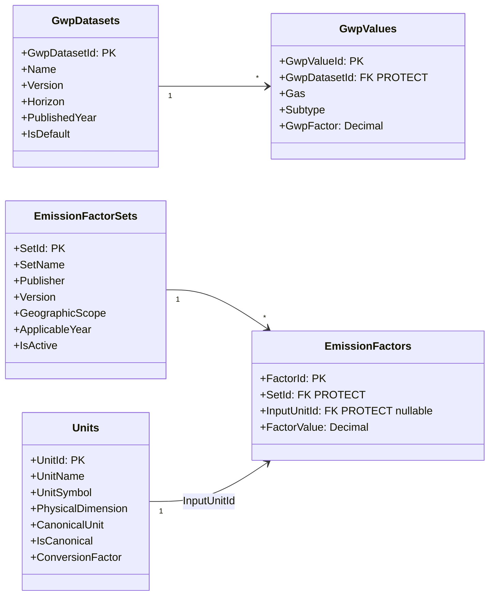
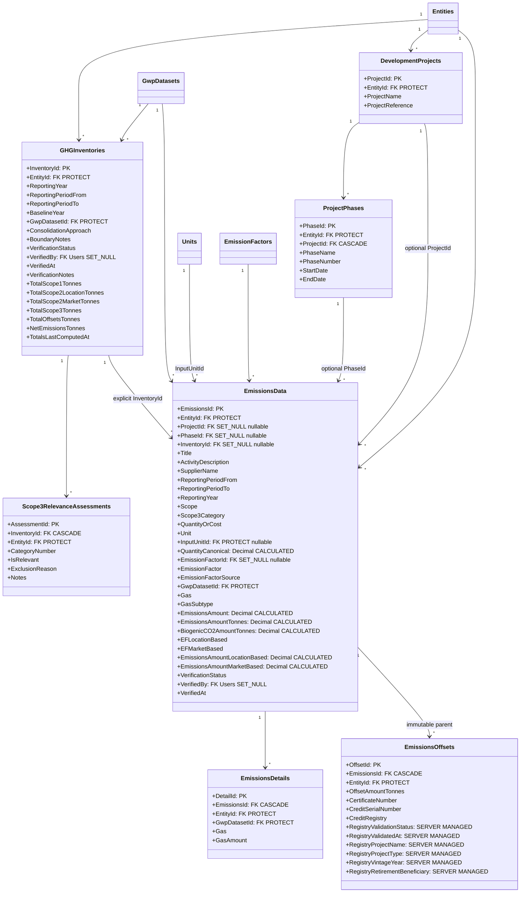
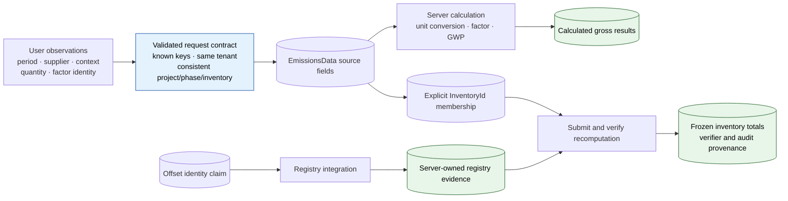
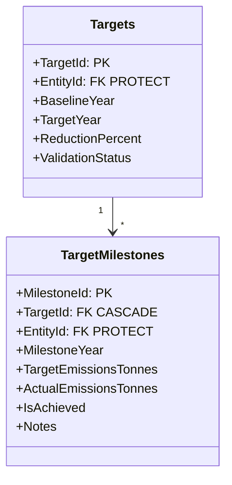
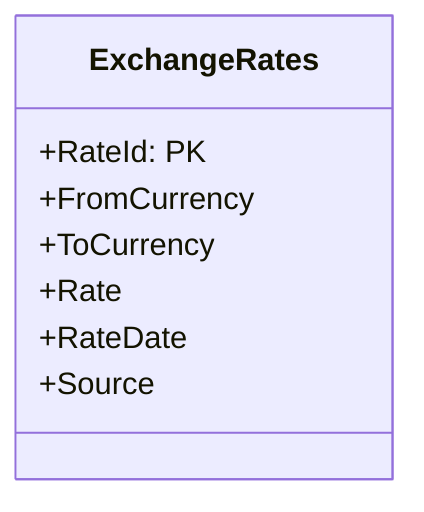

# 03 — GHG Accounting Domain Model

The emissions core: source observations, operational relationships, formal inventory
membership, calculation reference data, assurance provenance, targets, and offsets.

**Related user stories** — [GHG accounting — SDO-GHG-01…14](../../stories/02-ghg-accounting.md) · [Inventory & assurance — SDO-INV-01…14](../../stories/03-inventory-assurance.md) · [Nature & MRV — SDO-NAT-11…14](../../stories/04-nature-mrv.md)

**Linear traceability** — [SUS-19 · inventory contract](https://linear.app/susdevos/issue/SUS-19/cfi-002-make-ghg-inventory-creation-satisfy-its-data-contract) · [SUS-21 · source-field preservation](https://linear.app/susdevos/issue/SUS-21/cfi-001-stop-silently-discarding-emission-form-fields) · [SUS-22 · tenant ownership](https://linear.app/susdevos/issue/SUS-22/cfi-006-enforce-tenant-ownership-on-every-critical-relationship) · [SUS-24 · assurance transition](https://linear.app/susdevos/issue/SUS-24/cfi-005-put-inventory-verification-behind-an-authorised-transition) · [SUS-25 · project/phase/inventory assignment](https://linear.app/susdevos/issue/SUS-25/cfi-008-connect-project-phases-and-inventory-assignment-end-to-end) · [SUS-31 · offset parent](https://linear.app/susdevos/issue/SUS-31/cfi-013-make-standalone-offset-creation-preserve-its-parent-emission) · [SUS-32 · registry result ownership](https://linear.app/susdevos/issue/SUS-32/cfi-014-prevent-clients-from-self-validating-carbon-offsets) · [SUS-33 · exact membership totals](https://linear.app/susdevos/issue/SUS-33/cfi-015-compute-formal-inventory-totals-from-explicit-inventory)

## Reference data — units, factors, GWP

The backend can convert through `InputUnitId`, but the first-party form still supplies only
free-text `Unit`; the denominator/canonical-unit contract remains open in
[SUS-20](https://linear.app/susdevos/issue/SUS-20/cfi-003-define-and-enforce-the-canonical-emission-unitfactor-contract).

## Inventory, project, emissions, and offsets

Calculated emission fields are overwritten by `EmissionsData.save()` →
`compute_emissions()`. Inventory status/provenance/totals and offset registry results are
server-managed request fields: normal client mutation is rejected with HTTP 400 rather than
silently trusted. Every critical relationship is validated against the active request entity.

`InventoryId` is nullable because working records can exist before formal assignment. Once
assigned, it—not reporting year—is the authoritative membership boundary. Offsets inherit that
membership through their immutable parent emission.

## Field lineage

## Targets

Targets are generic reduction targets. There is deliberately no SBTi validation or registry
sync. `tasks.emissions.link_milestone_actuals` populates milestone actuals nightly from formal
inventory net totals.

## Currency

FX sync populates reference rates, but spend-based emissions calculation does not yet consume
them; the domain diagram does not imply that missing join is implemented.

---
*Source: `backend/apps/emissions/models.py`, `backend/apps/emissions/serializers.py`,
`backend/apps/emissions/services.py`, `backend/apps/projects/models.py`,
`backend/tasks/emissions.py`, `backend/tasks/integrations/fx.py`*
