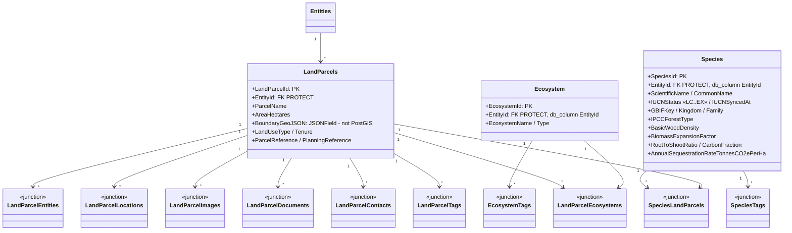
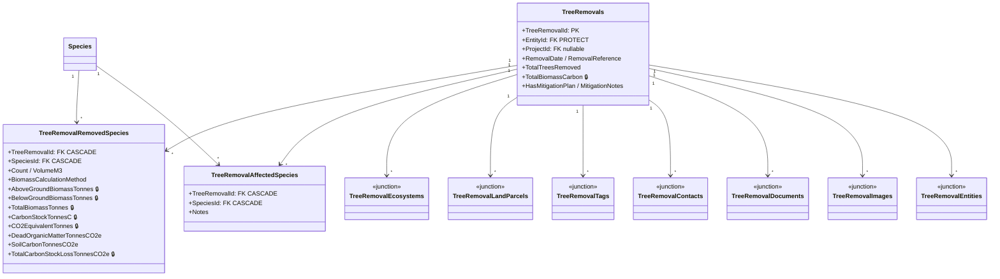
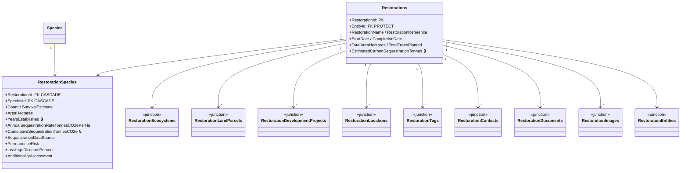
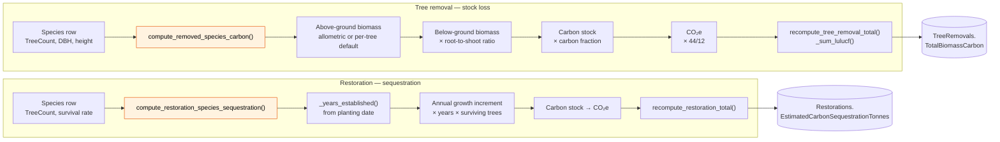

# 04 — Nature & MRV Domain Model

Land, ecosystems, species, and the two carbon-flux processes: **tree removals**
(stock loss) and **restorations** (sequestration). This is the IPCC LULUCF /
TNFD side of the platform.

**Related user stories** — [Nature & MRV — SDO-NAT-01…15](../../stories/04-nature-mrv.md)

## Land & ecosystem

> **✅ F1 · Tenant isolation — real foreign key — fixed 2026-08-21.**
> Both fields used to be declared as `EntityId = models.IntegerField(help_text="FK to
> entities.Entities")` (`apps/ecosystem/models.py:27,52`) rather than as a real `ForeignKey`.
> With no relation, `TenantViewSetMixin.get_queryset()` could not filter them, so those
> viewsets mixed in only `EntityScopeInitialMixin` and enforced scoping in their own
> `get_queryset()` — a new endpoint that forgot the filter would have returned **every
> tenant's** species and ecosystems, silently and with no exception raised.
> **Now:** both fields are `models.ForeignKey("entities.Entities", on_delete=models.PROTECT,
> db_column="EntityId")`. `db_column` keeps the existing column name, so migration
> `ecosystem/0004` is `AlterField` only — confirmed with `sqlmigrate` before applying, no
> rename or data migration. Both viewsets now use `TenantViewSetMixin`, making isolation
> structural rather than conventional, which also closed a gap nobody had flagged: neither
> viewset previously wrote any `AuditLog` entries or set `UpdatedBy` — they now do. Regression
> tests remain in place (`apps/ecosystem/tests/test_tenant_scope.py`,
> `apps/land/tests/test_ecosystem_link_isolation.py`).
> See [F1 in the findings register](../FINDINGS.md#f1).

## Tree removals — carbon stock loss

The distinction between **removed** and **affected** species is the TNFD-relevant one:
removed species carry the biomass/carbon computation, affected species record ecological
impact without a carbon figure.

## Restorations — sequestration

## Biomass carbon calculation

Both sides share the same IPCC LULUCF shape, implemented in
`apps/restorations/services.py`:

Species-level parameters resolve through `_param(species, attr, forest_default_key)`:
the species' own value when set, otherwise the IPCC default for its `IPCCForestType`.

## External species enrichment

`apps/ecosystem/integrations.py` reaches **GBIF** (taxonomy / occurrence) and **IUCN**
(Red List status) to populate `Species.IUCNStatus` and canonical naming. This is a
synchronous, user-triggered lookup at species-creation time — not a scheduled sync.

---
*Source: `backend/apps/land/models.py`, `backend/apps/ecosystem/models.py`,
`backend/apps/restorations/models.py`, `backend/apps/restorations/services.py`,
`backend/apps/ecosystem/integrations.py`*
