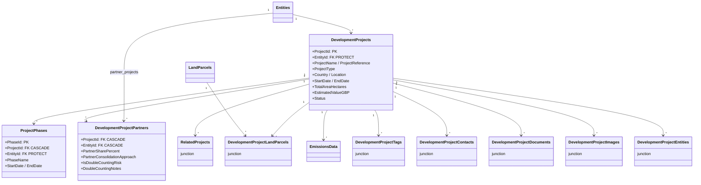
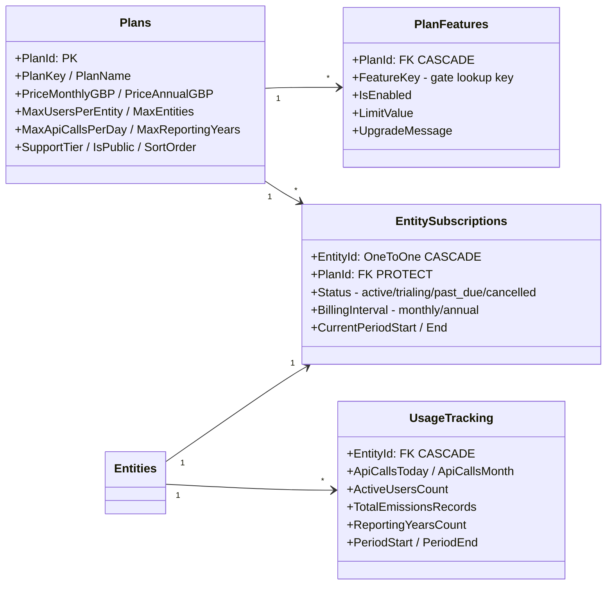
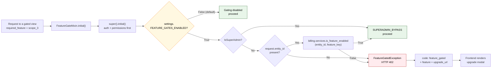
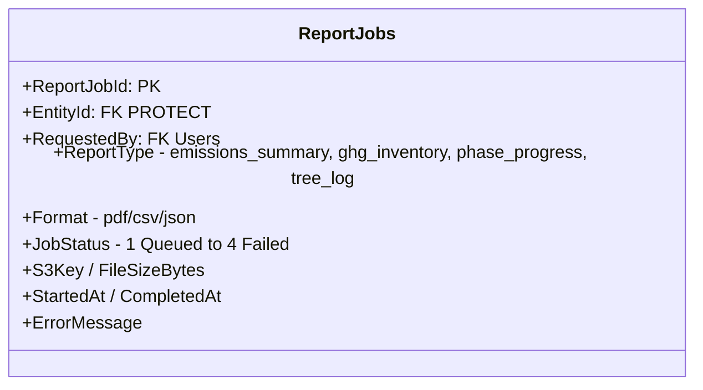
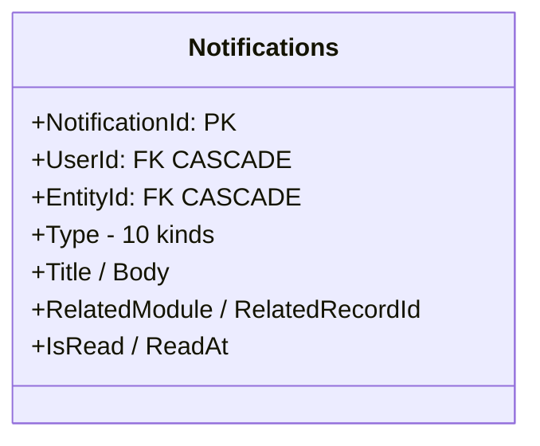
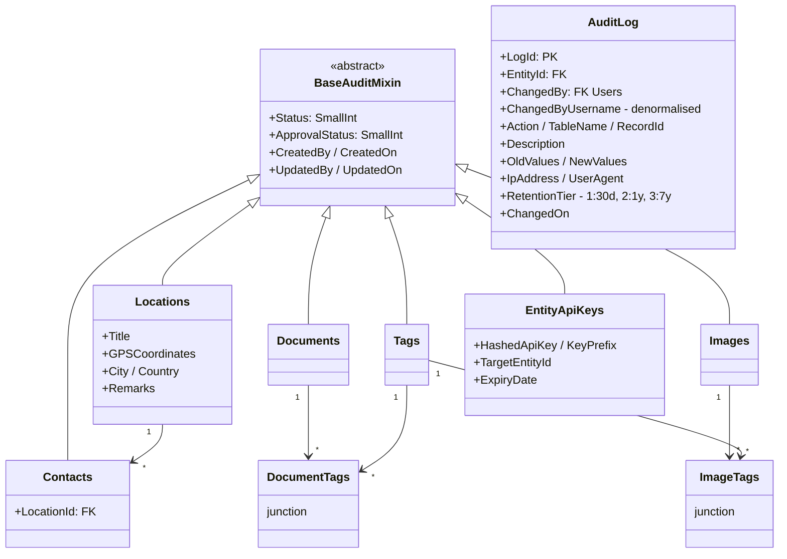
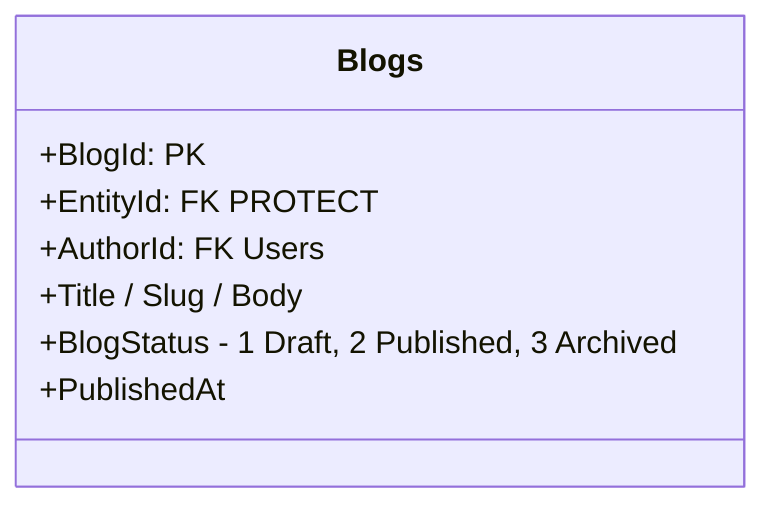

# 05 — Platform Services Domain Model

Cross-cutting infrastructure: projects, billing, reports, notifications, audit,
and the shared resource pool every module attaches to.

**Related user stories** — [Billing & platform — SDO-BIL-01…13](../../stories/06-billing-platform.md) · [Reporting — SDO-REP-01…11](../../stories/05-reporting-notifications.md)

## Development projects

A project can be **shared** across entities via `DevelopmentProjectPartners` — the partner
entity gets a role, while the owning entity remains `DevelopmentProjects.EntityId`.

## Billing & feature gating

`EntitySubscriptions.EntityId` is a **OneToOne** — an entity has at most one subscription.
`PlanId` is `PROTECT`, so a plan that any entity subscribes to cannot be deleted.

Seeded state: 5 plans, 117 `PlanFeatures` rows. `seed_plans` must run **before** any entity
is created, because `EntityCreateSerializer` attaches the free plan on creation.

### Gate enforcement path

> **⚪ Currently switched off.** `settings.FEATURE_GATES_ENABLED` defaults to `False`, so
> every request takes the `OFF` branch below and no capability is gated. Packaging moved to
> service and hosting tiers. The path is kept and still tested from both positions of the
> switch (`apps/billing/tests/test_entitlement.py`), so re-enabling gating is a settings
> flip. See [SDO-BIL-03](../../stories/06-billing-platform.md#sdo-bil-03).

> The switch is read inside `is_feature_enabled()` **and** at the top of
> `FeatureGateMixin._check_feature_gate()`. Both are needed: the `entity_id`-missing branch
> denies without ever reaching `is_feature_enabled()`, so short-circuiting only the service
> function would still have 402'd a request that arrived without an entity header.

> **✅ F5 · Documentation drift — gate status code documented — fixed 2026-08-21.**
> `CLAUDE.md` documented the gate's response body (`{"code": "feature_gated", ...}`) but not
> its status code. The code raises `FeatureGatedException` carrying
> `status_code = HTTP_402_PAYMENT_REQUIRED` (`apps/billing/mixins.py:53`), converted to a
> response by the handler in `apps/shared/exceptions.py`. A frontend developer writing an
> interceptor could reasonably have assumed the platform's conventional 403, in which case the
> handler never fires and the upgrade modal silently fails to appear.
> **Now:** `CLAUDE.md` states the gate returns **HTTP 402 Payment Required** and includes the
> `detail` key the handler actually returns — the original example omitted it, a second
> inaccuracy in the same line. Nothing about the code changed; 402 was already the right choice
> for a billing gate.
> See [F5 in the findings register](../FINDINGS.md#f5).

> **✅ F8 · Billing — grace period until `CurrentPeriodEnd` — fixed 2026-08-21.**
> `is_feature_enabled()` used to resolve a subscription only with `Status__in = ["active",
> "trialing"]` (`apps/billing/services.py:21`). A `past_due` subscription matched nothing, so a
> customer whose card expired would have hit 402 on Scope 3 entry, land parcels, offsets and
> report export all at once, mid-dunning, while still a paying customer — though nothing in the
> repo actually sets `past_due` (no Stripe webhook, no dunning logic), so this was
> forward-looking policy rather than a live outage.
> **Now:** a single `get_entitled_subscription()` helper replaces the status filter that was
> duplicated across `is_feature_enabled()` and `get_active_plan()`. A `past_due` subscription
> keeps its entitlements while `now() <= CurrentPeriodEnd` — it paid for the period it is in —
> and loses them once that passes. `can_add_entity()`'s fail-open behaviour was left as-is, with
> a comment naming the asymmetry against the two fail-closed callers; changing that is a
> separate product decision.
> See [F8 in the findings register](../FINDINGS.md#f8).

## Reports

## Notifications

Types: `user_created`, `emissions_submitted`, `emissions_verified`, `emissions_unlocked`,
`system_error`, `access_denied`, `entity_created`, `password_reset`, `report_ready`,
`report_failed`.

## Shared resources & audit

`BaseAuditMixin` is inherited by nearly every domain model — that is where the universal
`Status` / `CreatedBy` / `UpdatedOn` columns come from. `TenantViewSetMixin.get_queryset()`
filters `Status__lt=4`, so status 4 is the soft-delete tombstone.

### Audit retention tiers

| Tier | Retention | Applies to |
|------|-----------|------------|
| 1 | 30 days | Low-value trace events |
| 2 | 1 year *(default)* | Login / session events |
| 3 | 7 years | CRUD and regulatory events — e.g. `Unlock_Verified` |

`tasks.auth.purge_expired_audit_logs` (05:30 daily) enforces these, served by the
`idx_audit_retention` index on `(RetentionTier, ChangedOn)`.

## Blog / CMS

Dual-router: authenticated CMS CRUD under `/api/blog/`, plus an unauthenticated public
reader at `/api/public/blog/{slug}/` (`apps/blog/urls_public.py`) serving the marketing site.

---
*Source: `backend/apps/projects/models.py`, `backend/apps/billing/`,
`backend/apps/reports/models.py`, `backend/apps/notifications/models.py`,
`backend/apps/shared/models.py`, `backend/apps/blog/`*
