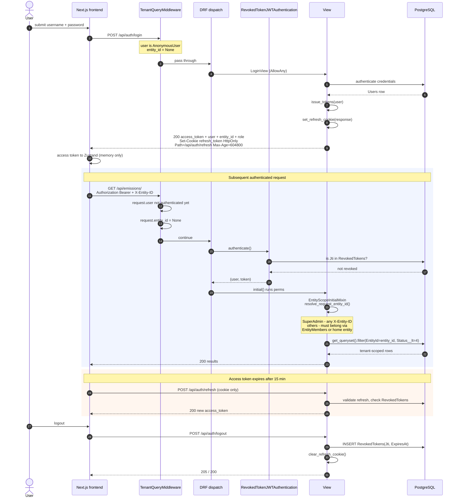
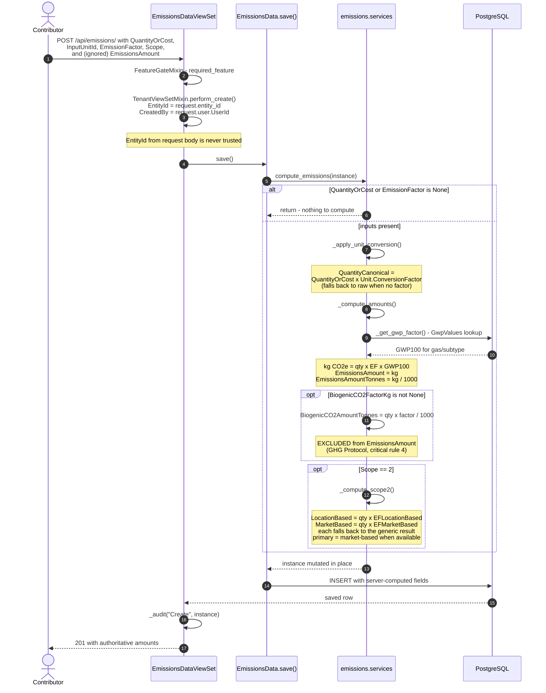
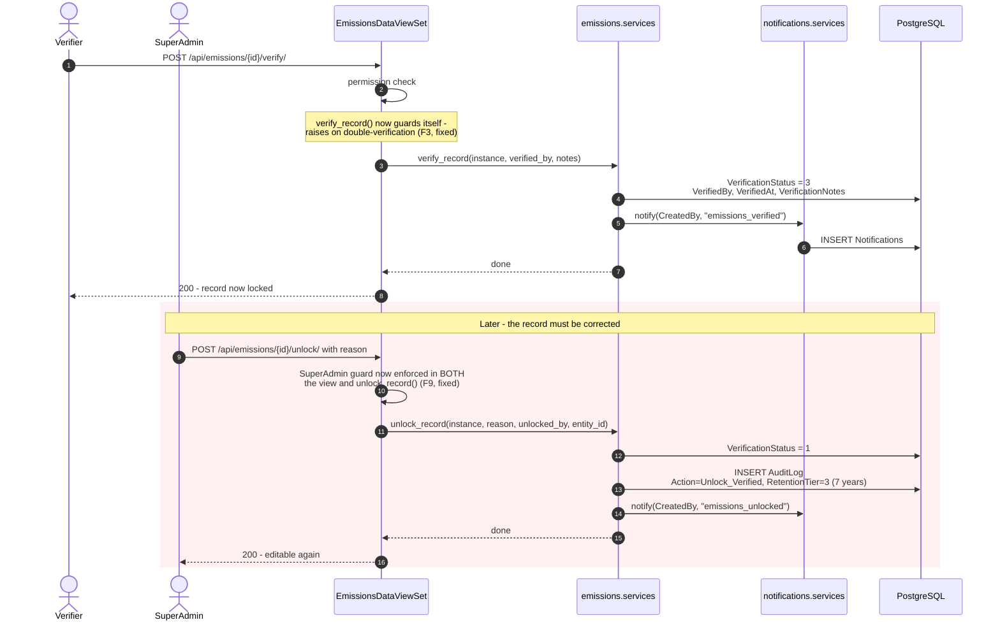
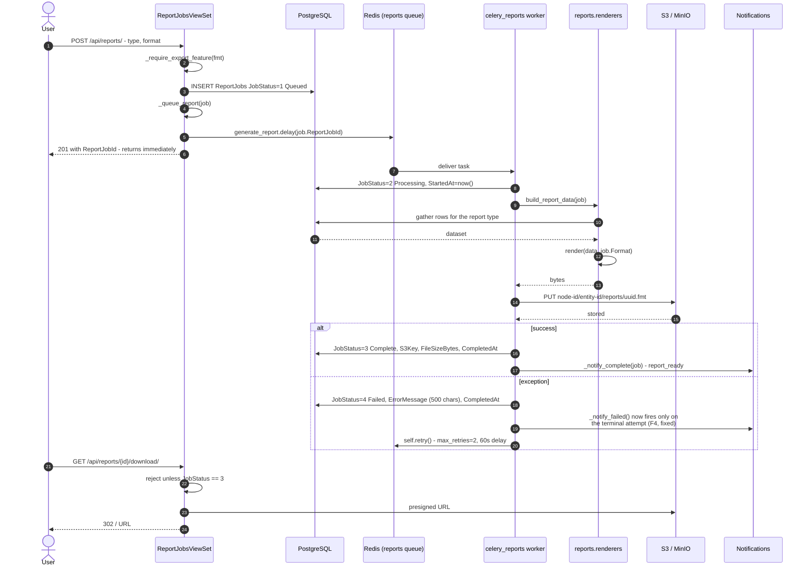

# 06 — Request & Calculation Sequences

The four interaction paths a reviewer most needs to trace end to end.

## 6.1 Login, tenant resolution, and refresh

Revocation is server-side and immediate: `RevokedTokenJWTAuthentication.get_validated_token()`
rejects any token whose `Jti` is present in `RevokedTokens`, rather than waiting for the
15-minute expiry. `tasks.auth.purge_expired_revoked_tokens` (05:00 daily) sweeps rows whose
underlying token has expired anyway.

## 6.2 Emissions record creation and server-side calculation

Three behaviours worth confirming in review, all deliberate and commented in
`services.py`:

- `QuantityCanonical` is tested with `is None`, not truthiness — a legitimate canonical
  value of zero must not silently revert to the raw quantity.
- Clearing `BiogenicCO2FactorKg` on a re-save also clears `BiogenicCO2AmountTonnes`,
  so a record that stops being biogenic does not keep reporting a stale figure.
- Scope 2 location/market amounts are recomputed unconditionally on every save (`else`,
  not `elif ... is None`), which keeps re-saves idempotent instead of retaining a stale
  value from the previous save.

## 6.3 Verification and unlock

The unlock path is the compliance-sensitive one: it is SuperAdmin-only, requires a reason,
and always writes a 7-year-retention audit row.

> **✅ F9 · Authorization — guard moved into the service — fixed 2026-08-21.**
> `unlock_record()` (`apps/emissions/services.py:169`) performed the privileged state change
> and wrote the mandatory audit row, but its own docstring said outright: *"Only callable by
> SuperAdmin — the view enforces that guard."* The function itself checked nothing, so any
> future call site that was not the viewset — a management command, an admin action, a
> bulk-correction task — could unlock verified records with no SuperAdmin check.
> **Now:** `unlock_record()` raises `PermissionDenied` when `unlocked_by` is not a SuperAdmin —
> it already received the acting user, so it always had the context to check. The guard runs
> before any mutation or audit write, so a rejected unlock leaves no trace. The view's inline
> check is retained for its specific response body, so the guard now lives in both places. This
> was the same structural pattern as **F3**, fixed the same way: the check now sits in the
> layer that owns the invariant.
> See [F9 in the findings register](../FINDINGS.md#f9).

## 6.4 Asynchronous report generation

`generate_report` carries `time_limit=300`, `max_retries=2`, `default_retry_delay=60`. The
worker runs with `--max-tasks-per-child=10` because PDF rendering leaks memory over time.

> **✅ F4 · UX / async — notification deferred to the terminal attempt — fixed 2026-08-21.**
> In `backend/tasks/reports.py:65-68` the job used to be marked `Failed` and `_notify_failed()`
> fired, and only then was `self.retry()` raised — so a transient S3 timeout on attempt 1 told
> the user their report failed, and a successful attempt 2 sixty seconds later told them it was
> ready. The user got a failure notice for a report that worked, and could re-request one
> already being generated.
> **Now:** `_notify_failed()` fires only when `self.request.retries >= self.max_retries`. The
> `JobStatus = 4` write still happens on every attempt — "Failed" is an honest description of
> the job's state between attempts; it was only the *notification* that was premature. Three
> tests cover retries-remaining, the terminal attempt, and the happy path.
> See [F4 in the findings register](../FINDINGS.md#f4).

---
*Source: `backend/apps/users/views.py`, `backend/apps/users/authentication.py`,
`backend/apps/entities/middleware.py`, `backend/apps/shared/views.py`,
`backend/apps/emissions/services.py`, `backend/apps/reports/views.py`,
`backend/tasks/reports.py`*
