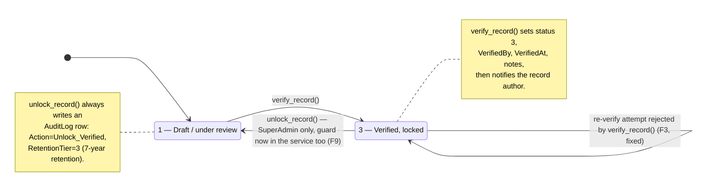
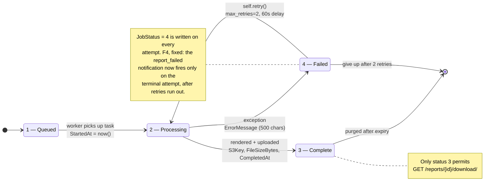
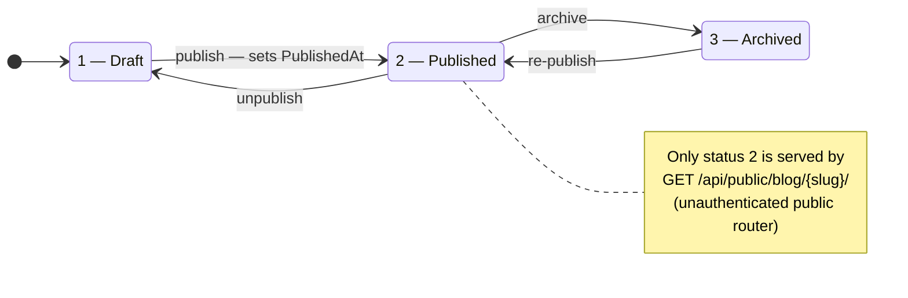
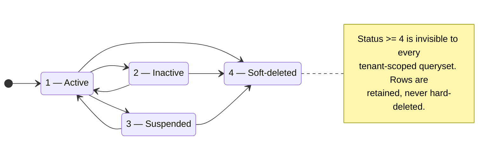
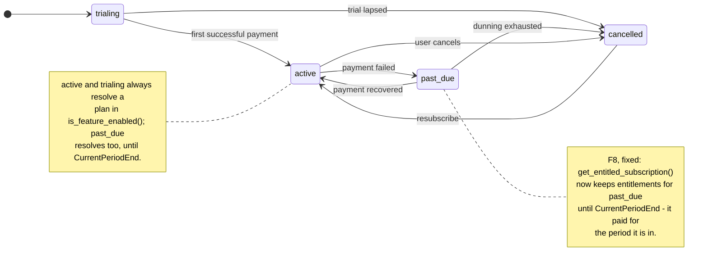

# 07 — State Machines

Every lifecycle in the system that is driven by a status column, and the transitions
that are legal between states.

**Related user stories** — [Inventory & assurance — SDO-INV-05…10, 14](../../stories/03-inventory-assurance.md) · [Nature & MRV — SDO-NAT-11…13](../../stories/04-nature-mrv.md) · [Reporting — SDO-REP-03](../../stories/05-reporting-notifications.md) · [Billing — SDO-BIL-06, 07](../../stories/06-billing-platform.md)

**Linear traceability** — [SUS-24 · inventory verification](https://linear.app/susdevos/issue/SUS-24/cfi-005-put-inventory-verification-behind-an-authorised-transition) · [SUS-32 · offset validation ownership](https://linear.app/susdevos/issue/SUS-32/cfi-014-prevent-clients-from-self-validating-carbon-offsets) · [SUS-33 · verification over exact members](https://linear.app/susdevos/issue/SUS-33/cfi-015-compute-formal-inventory-totals-from-explicit-inventory)

## 7.1 GHG inventory verification

`GHGInventories.VerificationStatus` is server-managed. The public first-party workflow has
only two forward transitions and one privileged correction path.

```mermaid
stateDiagram-v2
    direction LR
    [*] --> Unverified

    Unverified: 1 — Unverified
    Pending: 2 — Pending
    VerifiedFirst: 3 — Verified, First Party
    VerifiedThird: 4 — Verified, Third Party

    Unverified --> Pending: POST /submit/; reconcile + recompute + audit
    Pending --> VerifiedFirst: Entity Admin POST /verify/; recompute + provenance + audit
    VerifiedFirst --> Unverified: SuperAdmin POST /unlock/; mandatory reason + audit
    VerifiedThird --> Unverified: SuperAdmin POST /unlock/ for legacy/admin state

    note right of VerifiedFirst
        Status >= 3 is immutable.
        Inventory, member, detail, and offset
        writes return 403 until unlock.
    end note

    note right of VerifiedThird
        Model-reserved compatibility state.
        No public endpoint or UI transition
        can claim third-party assurance.
    end note

    note left of Unverified
        Normal POST/PATCH cannot set status,
        verifier, notes, timestamp, or totals;
        serializer returns HTTP 400.
    end note
```

There is no implemented Pending → Unverified rejection route and no inbound transition to
third-party status `4`. Documentation must not imply either exists. Both retained verified
states still inherit the `>= 3` immutability guard.

## 7.2 Emissions record verification

`EmissionsData.VerificationStatus` — same shape, but note the field is a bare
`PositiveSmallIntegerField(default=1)` with **no `choices`** declared, unlike its
inventory counterpart.

> **✅ F3 · Data integrity — guard moved into the service — fixed 2026-08-21.**
> `verify_record()` (`apps/emissions/services.py:145`) used to state in its own docstring that
> it "does not guard against double-verification" — the caller had to check current status
> first, and only `EmissionsDataViewSet` did. The `Verified → Verified` self-transition above
> was reachable from any future call site — a retried request, a management command, a
> bulk-verify endpoint — and would silently overwrite `VerifiedBy`, `VerifiedAt` and
> `VerificationNotes` with the second caller's identity, losing the original verifier's
> attestation with no audit record.
> **Now:** `verify_record()` raises `ValidationError({"code": "already_verified"})` when
> `VerificationStatus >= 3`, so every call site inherits the guard, not only the viewset. The
> view's own check is retained deliberately — it returns the exact response body existing
> tests assert on, so the API is unchanged. A test calls the service directly twice and asserts
> `VerifiedBy`/`VerifiedAt` survive the second call.
> See [F3 in the findings register](../FINDINGS.md#f3).

## 7.3 Report job

`ReportJobs.JobStatus`, driven by `tasks.reports.generate_report`.

`tasks.reports.purge_expired_reports` (04:00 daily) deletes expired jobs and their S3
objects via `_delete_s3_objects()`.

## 7.4 Carbon credit registry validation

`EmissionsOffsets.RegistryValidationStatus` is a server-owned result. Users supply identity
evidence; nightly registry tasks supply the validation outcome.

```mermaid
stateDiagram-v2
    direction LR
    [*] --> Unverified

    Unverified: unverified — default on create
    Pending: pending — accepted legacy/system queue state
    Valid: valid — serial found in registry
    Invalid: invalid — serial absent

    Unverified --> Valid: registry task finds a conclusive match
    Unverified --> Invalid: usable registry response has no match
    Pending --> Valid: registry task finds a conclusive match
    Pending --> Invalid: usable registry response has no match
    Valid --> Unverified: identity evidence changed; results cleared
    Invalid --> Unverified: identity evidence changed; results cleared
    Unverified --> Unverified: identity evidence edited before validation

    note right of Valid
        Integration may backfill project, vintage,
        and beneficiary evidence. API clients
        cannot write any result field.
    end note

    note left of Invalid
        Network/server failure or an empty Verra
        CSV writes no downgrade. Only a usable,
        conclusive lookup can set invalid.
    end note
```

Registries: `verra` (VCS) and `gold_standard`, synced at 03:00 and 03:30 daily onto the
`integrations` queue. The Verra CSV is streamed, not buffered. Valid/invalid rows are not
automatically revalidated by the current task query; editing identity evidence deliberately
clears stale proof and returns the row to `unverified`. Gold Standard claim-depth hardening and
coverage remain tracked by SUS-32.

## 7.5 Blog post

`Blogs.BlogStatus` — gates what the public marketing router will serve.

## 7.6 Soft-delete — the universal status column

Every model inheriting `BaseAuditMixin` carries a `Status` column that
`TenantViewSetMixin.get_queryset()` filters with `Status__lt=4`.

## 7.7 Subscription

`EntitySubscriptions.Status`.

---
*Source: `backend/apps/emissions/models.py`, `backend/apps/emissions/services.py`,
`backend/apps/reports/models.py`, `backend/tasks/reports.py`,
`backend/apps/billing/models.py`, `backend/apps/blog/models.py`,
`backend/apps/shared/models.py`, `backend/apps/shared/views.py`*
