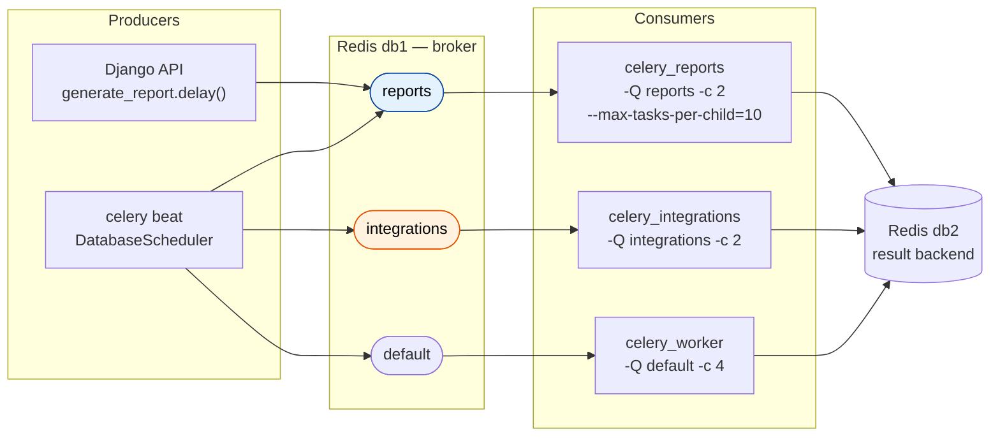
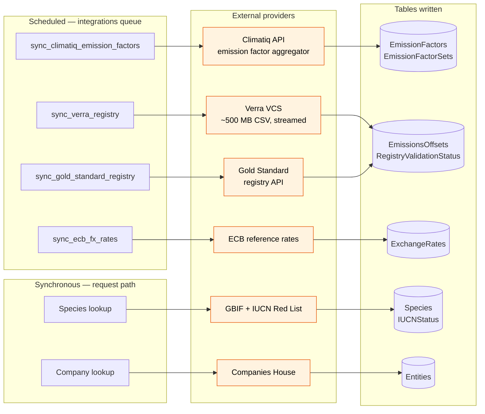

# 08 — Asynchronous Task Topology

Celery queues, the beat schedule, and where each task reaches outside the platform.


**Related user stories** — [Billing & platform — SDO-BIL-13](../../stories/06-billing-platform.md) · [Backlog — SDO-GAP-09](../../stories/07-backlog-gaps.md)

## Queue routing



Routing is declared in `config/celery.py`:

```python
app.conf.task_routes = {
    "tasks.integrations.*": {"queue": "integrations"},
    "tasks.reports.*":      {"queue": "reports"},
}
```

Anything not matching those prefixes lands on `default`. The `integrations` queue is isolated
because its tasks are slow and network-bound; `reports` is isolated because PDF rendering is
memory-hungry, hence `--max-tasks-per-child=10` to recycle workers.

> **✅ F6 · Operational — startup validator, fixed on the second attempt — fixed 2026-08-21.**
> The task modules live in a top-level `tasks/` package rather than inside Django apps, so
> `app.autodiscover_tasks()` does not find them; `config/celery.py:22-29` imports all eight
> modules explicitly to compensate. Without a check, a developer adding `tasks/foo.py` and
> registering it in `beat_schedule` would deploy cleanly — beat publishes the task, no worker
> has it registered, and every firing raises `NotRegistered` worker-side, with nothing wrong
> visible in Django admin.
> **Now — and the first attempt was wrong.** A validator comparing `beat_schedule` names
> against `app.tasks` was initially hooked to `on_after_finalize`. Its own new test failed
> immediately: `on_after_finalize` fires in *every* process that merely imports the Celery app,
> with the registry still empty at that point, so it reported all 11 scheduled tasks as
> unregistered — and would have taken down the API container too. The working version hooks
> `beat_init` (this is beat's problem, not every process's) and calls
> `app.loader.import_default_modules()` before comparing. Verified end to end: beat boots clean
> and reports "beat_schedule validated: 11 scheduled tasks all registered." The shared helper
> `check_beat_schedule_registered()` is what the CI test calls, so the test and the runtime
> guard cannot drift apart.
> See [F6 in the findings register](../FINDINGS.md#f6).

## Beat schedule (UTC)

```mermaid
gantt
    title Nightly task schedule (UTC)
    dateFormat HH:mm
    axisFormat %H:%M

    section Billing
    reset_daily_api_counters      :00:00, 15m

    section Emissions
    recompute_stale_inventory_totals :01:00, 25m
    link_milestone_actuals           :01:30, 20m

    section Integrations
    sync_climatiq_emission_factors (Sun) :02:00, 50m
    sync_verra_registry                  :03:00, 25m
    sync_gold_standard_registry          :03:30, 25m
    sync_ecb_fx_rates                    :17:00, 15m

    section Housekeeping
    purge_expired_reports         :04:00, 20m
    purge_expired_revoked_tokens  :05:00, 15m
    purge_expired_audit_logs      :05:30, 20m
    prune_old_notifications       :05:45, 15m
```



*Bar widths indicate scheduling separation, not measured runtime.*

| Task | Schedule | Queue | Purpose |
|------|----------|-------|---------|
| `tasks.billing.reset_daily_api_counters` | 00:00 daily | default | Reset `UsageTracking` per-day counters |
| `tasks.emissions.recompute_stale_inventory_totals` | 01:00 daily | default | Re-aggregate inventory scope totals |
| `tasks.emissions.link_milestone_actuals` | 01:30 daily | default | Fill `TargetMilestones.ActualEmissionsTonnes` |
| `tasks.integrations.sync_climatiq_emission_factors` | 02:00 Sundays | integrations | Refresh emission factor library |
| `tasks.integrations.sync_verra_registry` | 03:00 daily | integrations | Validate VCS credit serials |
| `tasks.integrations.sync_gold_standard_registry` | 03:30 daily | integrations | Validate Gold Standard serials |
| `tasks.reports.purge_expired_reports` | 04:00 daily | reports | Delete expired jobs + S3 objects |
| `tasks.auth.purge_expired_revoked_tokens` | 05:00 daily | default | Sweep `RevokedTokens` past expiry |
| `tasks.auth.purge_expired_audit_logs` | 05:30 daily | default | Enforce retention tiers 1/2/3 |
| `tasks.auth.prune_old_notifications` | 05:45 daily | default | Trim read notifications |
| `tasks.integrations.sync_ecb_fx_rates` | 17:00 daily | integrations | ECB reference rates (published ~16:00 CET) |
| `tasks.integrations.sync_oer_fx_rates` | — | integrations | Open Exchange Rates alternative |
| `tasks.reports.generate_report` | on demand | reports | User-triggered report build |

> **✅ F7 · Operational — settled with evidence, not inspection — fixed 2026-08-21.**
> `tasks.auth.prune_old_notifications` and `tasks.integrations.sync_oer_fx_rates` were defined
> and imported, but neither appeared in `app.conf.beat_schedule`. `DatabaseScheduler` seeds
> `PeriodicTask` from `beat_schedule` at beat startup, so a task absent from the schedule gets
> no row at all and never runs unless someone adds it by hand in Django admin — which meant the
> two tasks needed checking separately rather than assuming one explanation covered both.
> **Now, split by task:** `prune_old_notifications` **was** a genuine oversight — it is now
> scheduled at 05:45 daily, and beat has synced it into the database, confirmed by querying
> `PeriodicTask` after startup. `sync_oer_fx_rates` is **correctly** unscheduled:
> `sync_ecb_fx_rates` already dispatches it via `.delay()` when the ECB source fails, and it
> already no-ops with a clear log line when `OPEN_EXCHANGE_RATES_API_KEY` is unset (it defaults
> to `""`). A comment in `config/celery.py` and a test now record that this omission is
> intentional — so only one of the two originally-flagged tasks turned out to be missing.
> See [F7 in the findings register](../FINDINGS.md#f7).

## External integration surface



The split matters for failure behaviour: scheduled integrations degrade quietly (stale data
until the next run, with retries), while the two synchronous lookups sit in the user's
request path — a provider outage there surfaces as a failed user action.

## Failure and retry posture

| Task | Retry policy | Failure mode |
|------|--------------|--------------|
| `generate_report` | `max_retries=2`, 60s delay, `time_limit=300` | Job → status 4 on every attempt; `report_failed` notification only on the terminal attempt (F4, fixed) |
| `sync_verra_registry` | Bound task with retry | Logs and aborts on `requests.RequestException`; offsets stay `pending` |
| `sync_ecb_fx_rates` | Bound task with retry | Previous day's rates remain in `ExchangeRates` |
| Purge tasks | None | Next night's run catches up |

---
*Source: `backend/config/celery.py`, `backend/tasks/`, `docker-compose.yml`*
